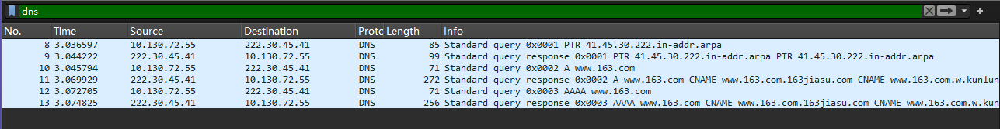

# 
计算机网络实验报告

## 
作业一

## 
网络空间安全学院 物联网工程

## 
2211489 冯佳明

## 习题1-1

> 网络的结构如下图所示，主机A与主机B之间通过3段链路和2台路由器（R1与R2）连接，每条链路的长度和传输速率在图中标出，R1与R2采用存储转发机制，主机B向主机A发送一个长度为9000字节的报文。设电磁波在有线链路与无线链路中的传播速度分别为2×10^8^米/秒与3×10^8^米/秒，忽略R2与AP之间连接使用的链路，忽略报文在R1与R2的路由决策与排队的延时。请回答以下3个问题： 
（1）如果采用报文交换模式，请计算报文传输的最小端到端延时（从主机B传输报文第一位开始，到主机A接收到报文最后一位所用的时间）（20分） 
（2）如果将报文平均分成3个分组依次传输，请计算完成报文传输的最小端到端延时（忽略报文封装成分组的开销）（20分） 
（3）如果考虑报文在路由器中的路由决策与排队过程，那么端到端延时不确定性的来源及影响最大的因素（10分）

解答： 
 
（3）

- 当路由器的输入或输出接口接收到的数据量超过了其处理能力，就会导致**排队现象**，进而增加传输延迟。

- 数据包需要经过路由器的转发才能到达目的地，每个路由器都必须根据当前的路由表做出转发决定。如果**路由决策**过程复杂，则会增加处理时间。

- 从一个节点到另一个节点的**物理距离**以及所使用**链路的带宽**都会影响延迟。

- 将报文分为较小的数据包可以减少单个数据包的传输时间，但增加了总的头部开销比例。但是数据包过多，会导致对数据进行**差错检验**的工作量更大。

- 过大的数据包则可能会面临**分片**问题。

## 习题1-2

>通过Windows命令行模式下的nslookup命令查询 www.163.com，同时打开Wireshark软件捕获上述nslookup相关的DNS报文。
请回答以下3个问题：
（1）提供nslookup查询结果截图，并对查询结果进行全面分析（20分）
（2）提供Wireshark捕获结果截图（仅过滤出DNS报文），并说明每条DNS报文的用途（20分）
（3）提供某个DNS报文详细信息截图，说明DNS服务使用哪种传输层协议，以及哪些措施可提高DNS服务可靠性（10分）

解答：
(1) 

- 本地DNS服务器：
  - 域名: 41.45.30.222.in-addr.arpa
  - IP地址：222.30.45.41
  - 当前的DNS使用逆向域名解析，返回的是与IP地址相关联的域名
- 非权威应答:
  - 表示该 DNS 服务器不是直接从权威服务器获取信息，而是通过查询**其他DNS服务器**或者使用自己的**缓存数据**获取的
- 名称：
  - www.163.com 实际上是一个别名，指向 www.163.com.w.kunluncan.com
  - 访问 www.163.com 实际上是通过 www.163.com.w.kunluncan.com 进行的
- IP地址：
  - IPv6地址：2408:8710:1020:fd00:3::3f8与2408:8710:1020:fd00:3::3f9
  - IPv4地址：111.161.79.232到111.161.79.237的一组连续地址
- 别名：
  - www.163.com 有多个别名，其中一个别名是 www.163.com.163jiasu.com 

（2）共捕获到六条DNS报文

① DNS逆向查询，将IP地址222.30.45.41 反解析为域名

② 逆向DNS查询的响应，返回IP 地址 222.30.45.41 对应的域名

③ 正向DNS查询，请求 www.163.com 的 IPv4 地址

④ 正向DNS查询的响应，返回域名 www.163.com 的别名记录与IPv4地址

⑤ 正向DNS查询，请求域名 www.163.com 的 IPv6 地址

⑥ 正向DNS查询的响应，返回域名 www.163.com 的别名记录与IPv6地址

（3）通过下图可以看到，数据包的上层协议为UDP提供的不可靠的传输层服务

可以通过**超时重传**，**差错检测**提高可靠性。~~~~