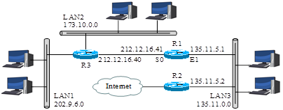
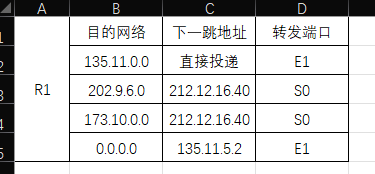
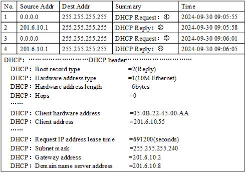

# 
计算机网络实验报告

## 
作业二

## 
网络空间安全学院 物联网工程

## 
2211489 冯佳明

## 习题2-1

> 互联网络的结构如下图所示。其中，LAN1、LAN2与LAN3是局域网，R1、R2与R3是路由器，R2接入Internet。图中出现的地址均为标准分类的IPv4地址，没有进一步将其划分子网。 
 
请回答以下3个问题：
（1）根据已知条件构造R1的路由表（包含目的网络、下一跳地址与转发端口），要求写出构造过程（40分） 
（2）如果R1收到一个目的地址为130.19.237.5的IP分组，那么R1将选择哪个端口作为下一跳的转发端口，要求写出判断过程（5分） 
（3）R1能否收到目的地址为127.1.1.1的IP分组，要求说明原因（5分） 

解答： 
（1）路由表如下图所示。 

- 由于R1和LAN1不在同一局域网内，所以R1无法直接转发到LAN1，需要通过R3进行转发，因此下一跳地址为212.12.16.40，使用S0端口。
- 同理，R1和LAN2不在同一局域网内，需要通过R3进行转发，因此下一跳地址为212.12.16.40，使用S0端口。
- 而R1和LAN3在同一局域网内，所以R1可以直接转发到LAN3，因此下一跳地址为应该为直接投递，使用E1端口。
- 此外，额外设置了默认路由，将数据包转发至R2的135.11.5.2，使用E1端口。 

（2）R1在收到这个IP分组后，会先与自身路由表进行比对，发现没有与这个IP分组的目的地址匹配的条目，因此会使用默认路由，将这个IP分组使用E1端口，转发至默认路由的下一跳地址（根据我的设定，将发至135.11.5.2）.

（3）理论上不能，在实际网络环境中，127.1.1.1所属于的127.0.0.0被保留为环回地址。环回地址仅在本机上有效，在遇到数据包的目的地为127.x.x.x这类地址时，系统会将其直接送往本地的网络栈处理，而不经过网络接口或路由器。因此，这类数据包不会从本机发出到网络中，也不经过路由器。

## 习题2-2

>WireShark捕获的DHCP交互过程如下图所示。其中，第4个DHCP报文包括详细解析结果。  
 
请回答以下4个问题： 
（1）图中①~④位置的DHCP请求或响应的正式名称（20分） 
（2）DHCP服务器的IP地址，DHCP报文传输采用单播还是广播模式（10分） 
（3）主机通过DHCP服务器获得的IP地址与租用期长度（10分） 
（4）主机从DHCP服务器获得DNS服务器与默认路由器的IP地址（10分） 

解答： 
（1） 
① **DHCPDISCOVER**：客户端广播此消息以发现可用的DHCP服务器。 
② **DHCPOFFER**：服务器回应DHCPDISCOVER，提供IP地址和其他配置信息。 
③ **DHCPREQUEST**：客户端发送此消息来请求提供的IP地址，或者续租现有IP地址。 
④ **DHCPACK**：服务器确认并授权客户端使用特定IP地址及配置参数。

(2)从图中可以看出，DHCP服务器的IP地址为**201.6.10.1**。

- DHCPDISCOVER：客户端不知道DHCP服务器的IP地址，会首先使用广播模式来找到服务器。
- DHCPOFFER：服务器收到DHCPDISCOVER后，会通过广播或单播方式向客户端发送响应消息。
  - 广播与单播取决于主机广播的DHCPDISCOVER中Bootp flags字段的值。
- DHCPREQUET：单播发送给DHCP服务器
- DHCPACK：单播发送给客户端

（3）通过图中可以看出，主机获得的IP地址是**201.6.10.55**，租期长度为**691200秒**。

（4）DNS服务器：**201.6.10.8**，默认路由器：**201.6.10.2**。