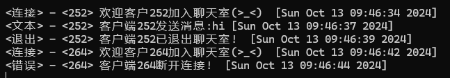
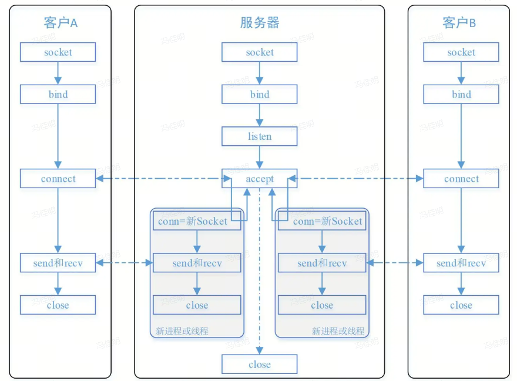
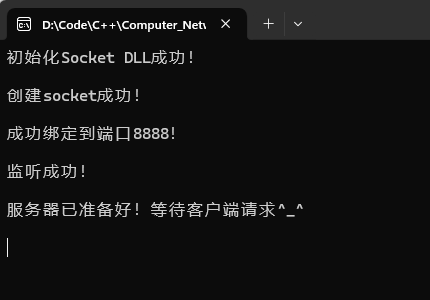
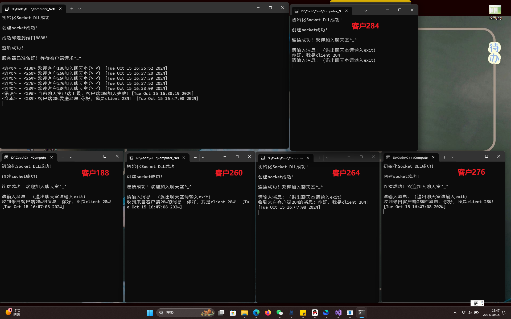
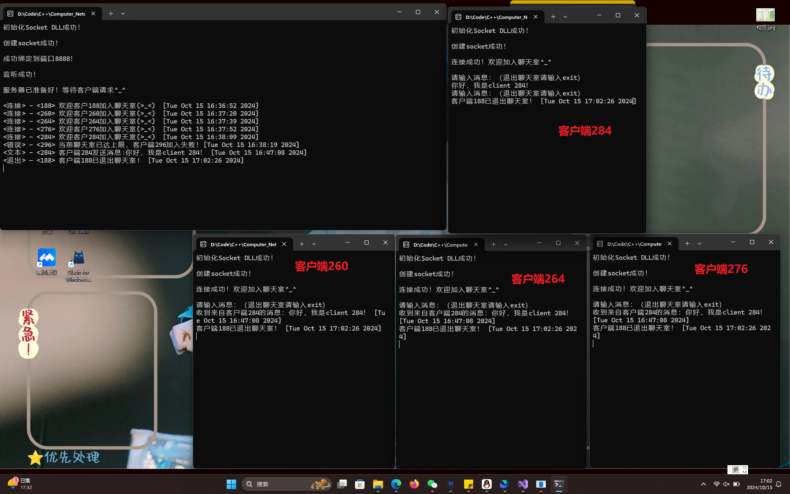
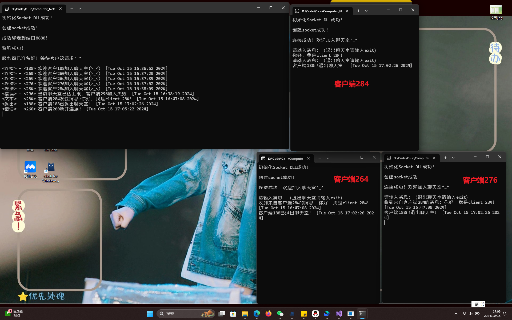
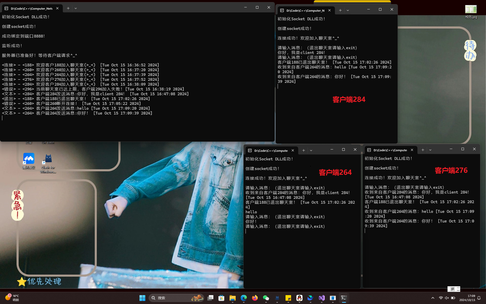
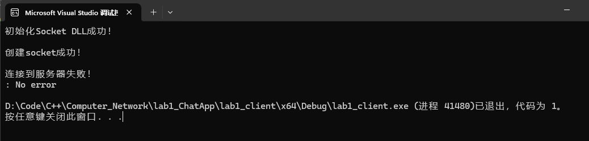

# <center>计算机网络实验报告</center>
## <center>LAB1 利用Socket编写聊天程序</center>
## <center>网络空间安全学院 物联网工程</center>
## <center>2211489 冯佳明</center>

# 一、协议设计
## 1. 协议
网络协议为计算机网络中进行数据交换而建立的规则、标准或约定的集合。由三个要素组成：
* **语义：** 是解释控制信息每个部分的意义。它规定了需要发出何种控制信息，以及完成的动作与做出什么样的响应。
* **语法：** 是用户数据与控制信息的结构与格式，以及数据出现的顺序。
* **时序：** 是对事件发生顺序的详细说明。

## 2. 实现
按照实验要求，本实验设计的协议如下：
* 使用TCP传输协议，使用流式套接字、采用多线程方式完成程序；
* 分别搭建服务器端server与客户端client；
* 设置缓冲区BUFFER_SIZE大小为1024；
* 设置客户端socket数组client_sockets[5]，一次最大连接数为5个客户端，超出连接数时，会自动关闭最新客户端的连接申请。


### 消息设置
消息类型分为由**连接消息**、**文本消息**、**退出消息**、**错误消息**。
* **连接消息：** 新用户连接时，服务器向其发送的欢迎消息，确认连接成功。
* **文本消息：** 客户端要发送给其他客户端的信息。服务器会将该消息转发到其他已连接的客户端，并在控制台上打印该消息及其来源。
* **退出消息：** 用于客户端退出聊天室,服务器会清理该客户端的资源，并通知其他客户端该客户端已断开连接。
* **错误消息：** 出现异常错误时候的提示信息。

### 语法
**消息格式为：** <消息类型> - <客户端id> 消息内容 [时间]
例如：</br>

### 时序
* **连接：** 客户端发起连接请求
  1. 连接数<5，接受连接并创建处理线程
  2. 连接数>=5，拒绝连接
* **消息发送：** 客户端发送消息，服务器端接收消息并广播给其他客户端
* **退出：** 客户端发送“exit”消息，标识想要退出聊天，服务器处理该消息，关闭与客户端的连接。

## 3. 完整性与创新性
* **完整性：** 协议包含了加入聊天、发送消息、退出聊天等聊天程序的基本功能，且所有消息均包含发送的时间，确保程序的完整性。
* **创新性：** 明确了消息的类型与格式，有较好的可读性。


# 二、代码分析</br>
</br>
基于上图所示的TCP服务架构编写程序代码。

## 1. 服务器端
允许最多5个客户端的同时连接，并将客户端发送的消息广播到其他客户端，通过多线程处理每个客户端与服务器端的通信。

首先声明使用到的端口号为8888端口，设置缓冲区大小为1024，设置客户端socket数组。
代码如下：
```cpp{.line-numbers}
#define PORT 8888  //端口号
#define BUFFER_SIZE 1024  //缓冲区大小
SOCKET server_socket, client_sockets[5]; //客户端socket数组
```

### main函数
在main函数中依照架构依次对服务器端进行socket创建、地址绑定、设置监听，并在每个环节依次设置错误处理输出，便于调试。
代码如下：
```cpp{.line-numbers}
	// 初始化WinSock
	WSADATA wsaData;
	if (WSAStartup(MAKEWORD(2, 2), &wsaData) != 0) {
		perror("初始化Socket DLL失败！\n");
		exit(EXIT_FAILURE);
	}
	else
	{
		cout << "初始化Socket DLL成功！\n" << endl;
	}

	;
	struct sockaddr_in server_address, client_address;	//定义服务器端和客户端地址
	socklen_t client_addr_len = sizeof(client_address);

	//创建socket
	server_socket = socket(AF_INET, SOCK_STREAM, IPPROTO_TCP);	//使用IPv4地址，流式套接字，TCP协议
	if (server_socket == -1)	//检查socket是否创建成功
	{
		perror("创建socket失败！ \n");
		exit(EXIT_FAILURE);
	}
	else
	{
		cout << "创建socket成功！\n" << endl;
	}

	// 设置地址信息
	memset(&server_address, '0', sizeof(server_address));
	server_address.sin_family = AF_INET;	//地址类型
	server_address.sin_addr.s_addr = htonl(INADDR_ANY);	//接受来自任意IP地址的连接
	server_address.sin_port = htons(PORT);	//端口号

	//绑定socket
	if (bind(server_socket, (struct sockaddr*)&server_address, sizeof(server_address)) < 0)
	{
		perror("绑定失败！\n");
		exit(EXIT_FAILURE);
	}
	else
	{
		cout << "成功绑定到端口" << PORT << "！\n" << endl;
	}

	//设置监听
	if (listen(server_socket, 5) != 0)
	{
		perror("监听失败！\n");
		exit(EXIT_FAILURE);
	}
	else
	{
		cout << "监听成功！ \n" << endl;
	}

	cout << "服务器已准备好！等待客户端请求^_^\n" << endl;

	memset(client_sockets, INVALID_SOCKET, sizeof(client_sockets)); // 初始化为无效套接字

```

* **WinSock初始化：** 初始化WinSock库，加载WinSock DLL。
  核心函数：WSAStartup(MAKEWORD(2, 2), &wsaData)
* **创建socket：** 创建用于服务器与客户端通信的socket，使用IPv4地址，流式套接字，TCP协议。
  核心函数：server_socket = socket(AF_INET, SOCK_STREAM, IPPROTO_TCP)
* **绑定socket：** 使服务器socket能够接收来自客户端的数据。
  核心函数：bind(server_socket, (struct sockaddr*)&server_address, sizeof(server_address))
* **设置监听：** 服务器端监听来自客户端的连接请求。
  核心函数：listen(server_socket, 5)

然后循环接收并处理客户端的连接请求。如果连接成功且聊天室在线客户端数量未达上限，为每个客户端创建一个线程以处理消息收发。
代码如下：
```cpp{.line-numbers}
	while (1)
	{
		SOCKET client_socket = accept(server_socket, (struct sockaddr*)&client_address, &client_addr_len);
		if (client_socket < 0)
		{
			perror("接受连接失败！\n");
			continue;
		}
		
		string timestamp = get_current_timestamp();
		bool add = 0;
		
		
		for (int i = 0; i < 5; i++)
		{
			if (client_sockets[i] == INVALID_SOCKET)
			{
				client_sockets[i] = client_socket;
				add = 1;
				break;
			}
		}
		if (!add)
		{
			cout << "<错误> - <" << client_socket << "> 当前聊天室已达上限，客户端" << client_socket << "加入失败！[" << timestamp << "]" << endl;

			closesocket(client_socket);
			continue;
		}


		cout << "<连接> - <" << client_socket << "> 欢迎客户" << client_socket << "加入聊天室(>_<)  [" << timestamp << "]" << endl;

		

		//创建线程
		HANDLE Thread = CreateThread(NULL, NULL, (LPTHREAD_START_ROUTINE)handle_client, (LPVOID)client_socket, 0, NULL);
		if (Thread == NULL)
		{
			perror("线程创建失败！\n");
			exit(EXIT_FAILURE);
		}
		else
		{
			CloseHandle(Thread);
		}
	}

```
* **接受客户端连接：** 接收并处理客户端的连接请求。
  核心函数：accept(server_socket, (struct sockaddr*)&client_address, &client_addr_len)
* **创建客户端线程：** 为每个客户端创建一个线程，调用handle_client函数进行消息处理。
  核心函数：HANDLE Thread = CreateThread(NULL, NULL, (LPTHREAD_START_ROUTINE)handle_client, (LPVOID)client_socket, 0, NULL);

### handle_client函数
接收客户端发送的消息，并转发给其他客户端。如果客户端发送"exit"，则将其从聊天室中移除并通知其他客户端。
核心函数：
1. 接受：recv(new_socket, buffer, sizeof(buffer) - 1, 0);
2. 发送：send(client_sockets[i], send_message, strlen(send_message), 0)

代码如下：
```cpp{.line-numbers}
DWORD WINAPI handle_client(LPVOID param)
{
	SOCKET new_socket = (SOCKET)(LPVOID)param;
	char buffer[BUFFER_SIZE];
	int bytes_read;

	while (1)
	{
		bytes_read = recv(new_socket, buffer, sizeof(buffer) - 1, 0);
		if (bytes_read <= 0)
		{
			string timestamp = get_current_timestamp();
			for (int i = 0; i < 5; i++)
			{
				if (client_sockets[i] == new_socket)
				{
					client_sockets[i] = INVALID_SOCKET; 
					break;
				}
			}
			cout << "<错误> - <" << new_socket << "> 客户端" << new_socket << "断开连接!  [" << timestamp << "]" << endl;
			closesocket(new_socket);

			return 0;
		}
		
		buffer[bytes_read] = '\0';

		string message(buffer);
		string timestamp = get_current_timestamp();
			
		if (message == "exit")
		{
			for (int i = 0; i < 5; i++)
			{
				if (client_sockets[i] == new_socket)
				{
					client_sockets[i] = INVALID_SOCKET;
					break;
				}
			}
			cout << "<退出> - <" << new_socket << "> 客户端" << new_socket << "已退出聊天室!  [" << timestamp << "]" << endl;

			for (int i = 0; i < 5; i++)
			{
				if (client_sockets[i] != INVALID_SOCKET && client_sockets[i] != new_socket)
				{
					char send_message[2048];
					send_message[0] = '\0';
					const char* message1 = "客户端";
					char message2[20];
					sprintf_s(message2, sizeof(message2), "%d", new_socket);
					const char* message3 = "已退出聊天室！";


					strcat_s(send_message, sizeof(send_message), message1);
					strcat_s(send_message, sizeof(send_message), message2);
					strcat_s(send_message, sizeof(send_message), message3);
					strcat_s(send_message, sizeof(send_message), " [");
					strcat_s(send_message, sizeof(send_message), timestamp.c_str());
					strcat_s(send_message, sizeof(send_message), "]");

					send(client_sockets[i], send_message, strlen(send_message), 0);
				}
			}
			closesocket(new_socket);
			return 0;
		}
		
		cout << "<文本> - <" << new_socket << "> 客户端" << new_socket << "发送消息:" << message << " [" << timestamp << "]" << endl;


		for (int i = 0; i < 5; i++) 
		{
			if (client_sockets[i] != INVALID_SOCKET && client_sockets[i] != new_socket) 
			{
				char send_message[2048];
				send_message[0] = '\0';
				const char* message1 = "收到来自客户端";
				char message2[20];
				sprintf_s(message2, sizeof(message2), "%d", new_socket);
				const char* message3 = "的消息：";
				
				
				strcat_s(send_message, sizeof(send_message), message1);
				strcat_s(send_message, sizeof(send_message), message2);
				strcat_s(send_message, sizeof(send_message), message3);
				strcat_s(send_message, sizeof(send_message), buffer);
				strcat_s(send_message, sizeof(send_message), " [");
				strcat_s(send_message, sizeof(send_message), timestamp.c_str());
				strcat_s(send_message, sizeof(send_message), "]");

				send(client_sockets[i], send_message, strlen(send_message), 0);
			}
		}

	}
	

	closesocket(new_socket); // 关闭socket
	return 0;
}
```

### get_current_timestamp函数
使用chrono库获取当前时间并转化为字符串格式。
```cpp{.line_numbers}
string get_current_timestamp() {
	auto now = chrono::system_clock::now();
	auto time_now = chrono::system_clock::to_time_t(now);

	char buffer[26];  // ctime生成的字符串长度
	ctime_s(buffer, sizeof(buffer), &time_now);

	// 移除换行符
	buffer[strlen(buffer) - 1] = '\0';

	return string(buffer);
}
```

## 2.客户端 
实现了将客户端连接到服务器，通过向服务器发送消息并从服务器接收消息完成基本的通信。

首先声明使用到的端口号为8888端口，设置缓冲区大小为1024。
代码如下：
```cpp{.line-numbers}
#define PORT 8888  //端口号
#define BUFFER_SIZE 1024  //缓冲区大小
```

### main函数
在main函数中依照架构依次对客户端进行socket创建、地址绑定、连接服务器，并在每个环节依次设置错误处理输出，便于调试。
代码如下：
```cpp{.line-numbers}
	// 初始化WinSock
	WSADATA wsaData;
	if (WSAStartup(MAKEWORD(2, 2), &wsaData) != 0) {
		perror("初始化Socket DLL失败！\n");
		exit(EXIT_FAILURE);
	}
	else
	{
		cout << "初始化Socket DLL成功！\n" << endl;
	}

	int client_socket;
	struct sockaddr_in server_address;	//定义服务器端和客户端地址

	//创建socket
	client_socket = socket(AF_INET, SOCK_STREAM, IPPROTO_TCP);	//使用IPv4地址，流式套接字，TCP协议
	if (client_socket == -1)	//检查socket是否创建成功
	{
		perror("创建socket失败！\n");
		exit(EXIT_FAILURE);
	}
	else
	{
		cout << "创建socket成功！\n" << endl;
	}

	// 设置地址信息
	memset(&server_address, '0', sizeof(server_address));
	server_address.sin_family = AF_INET;	//地址类型
	//server_address.sin_addr.s_addr = inet_addr("127.0.0.1");	//服务器IP地址
	server_address.sin_port = htons(PORT);	//端口号

	if (inet_pton(AF_INET, "127.0.0.1", &server_address.sin_addr.s_addr) <= 0) {
		perror("连接失败！\n");
		exit(EXIT_FAILURE);
	}

	//连接到服务器
	if (connect(client_socket, (struct sockaddr*)&server_address, sizeof(server_address)) < 0)
	{
		perror("连接到服务器失败！\n");
		exit(EXIT_FAILURE);
	}
	else
	{
		cout << "连接成功！欢迎加入聊天室^_^\n" << endl;
	}

	// 启动接收消息线程
	thread receiver(receive_messages, client_socket);
	receiver.detach(); // 分离线程，使其在后台运行
```
* **WinSock初始化：** 初始化WinSock库，加载WinSock DLL。
  核心函数：WSAStartup(MAKEWORD(2, 2), &wsaData)
* **创建socket：** 创建用于服务器与客户端通信的socket，使用IPv4地址，流式套接字，TCP协议。
  核心函数：socket(AF_INET, SOCK_STREAM, IPPROTO_TCP)
* **连接到服务器：** 连接到服务器，加入聊天室。
  核心函数：connect(client_socket, (struct sockaddr*)&server_address, sizeof(server_address))
* **创建线程：** 接收来自服务器的消息。
  核心函数：thread receiver(receive_messages, client_socket)

然后循环发送输入的消息到服务器，当用户想要退出时，输入“exit”即可退出聊天室。
核心函数：send(client_socket, message.c_str(), message.size(), 0)
代码如下：
```cpp{.line-numbers}
	while (1)
	{
		cout << "请输入消息：（退出聊天室请输入exit）" << endl;
		string message;
		getline(cin, message);

		// 发送消息到服务器
		if (send(client_socket, message.c_str(), message.size(), 0) == SOCKET_ERROR)
		{
			perror("发送消息失败！\n");
			break;
		}
		if (message == "exit")
		{
			perror("已成功退出聊天室！\n");
			break;
		}
	}
```

### receive_messages函数
循环使用recv函数接收消息并打印，如果连接断开或发生错误，则输出连接已断开的信息。
核心函数：recv(client_socket, buffer, sizeof(buffer) - 1, 0)
代码如下：
```cpp{.line-numbers}
void receive_messages(SOCKET client_socket) {
	char buffer[BUFFER_SIZE];
	while (1) {
		int bytes_received = recv(client_socket, buffer, sizeof(buffer) - 1, 0);
		if (bytes_received <= 0) {
			cout << "与服务器的连接已断开。" << endl;
			break;
		}
		buffer[bytes_received] = '\0'; // 确保字符串结束
		cout << buffer << endl;
	}
}
```

# 三、运行结果
1. 首先启动服务器server.exe，依次进行socket初始化、服务器端socket创建、绑定端口、设置监听、等待客户端连接。日志输出如下图所示：</br>


2. 运行客户端client.exe，依次启动六个客户端程序，可以看到在第六个客户296想要连接时，被服务器拒绝并关闭连接。</br>


3. 在客户端284的控制台输入“你好，我是client 284！”并按下回车，执行效果如下图所示。可以看到服务器端按照设置的消息格式打印了客户端284发送的消息，并将该消息广播到其他客户端。</br>


4. 在客户端188的控制台输入“exit”并按下回车，执行效果如下图所示。可以看到，客户端188的控制窗口消失，在服务器端打印了退出聊天室的消息，并将该消息广播到其他客户端。</br>


5. 将客户端260强行关闭，执行效果如下图所示。可以看到，客户端188的控制窗口消失，在服务器端打印了有关于客户端260的错误消息。</br>


6. 在在客户端264的控制台分别输入“hello”，“你好！”并按下回车，执行效果如下图所示。可以看到服务器端按照设置的消息格式打印了客户端264发送的消息，并将该消息广播到其他客户端。证明该程序支持中英文聊天。</br>


7. 如果不启动服务器端，直接运行客户端，会出现无法连接到服务器的情况，运行效果如下图所示。</br>


# 四、问题及分析
1. 在设计的初期，没有设置socket数组记录客户端的连接情况，导致出现无法标明消息发送方，且会收到自己发送的消息的情况，如下图所示。通过改用socket数组记录客户端连接情况，改进了该问题。</br>
