# 
计算机网络实验报告

## 
LAB2 配置Web服务器，分析HTTP交互过程

## 
网络空间安全学院 物联网工程

## 
2211489 冯佳明

# 实验要求
1. 搭建Web服务器（自由选择系统），并制作简单的Web页面，包含简单文本信息（至少包含专业、学号、姓名）、自己的LOGO、自我介绍的音频信息。
2. 通过浏览器获取自己编写的Web页面，使用Wireshark捕获浏览器与Web服务器的交互过程，使用Wireshark过滤器使其只显示HTTP协议。
3. 现场演示。
4. 提交HTML文档、Wireshark捕获文件和实验报告，对HTTP交互过程进行详细说明。

注：页面不要太复杂，包含所要求的基本信息即可。使用HTTP，不要使用HTTPS。

# 一、WEB服务器配置及页面制作
## 1. WEB服务器配置
本次实验，我使用Python内置的HTTP服务器模块http.server搭建了一个简易的Web服务器。同时也参考了文章https://blog.csdn.net/ben_xiao_hai_123/article/details/113828938 中的部分内容，进行服务器配置。
在控制台中通过命令python -m http.server 8080启动服务器。
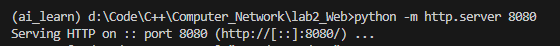

## 2. WEB页面制作
按照实验要求，编写代码。
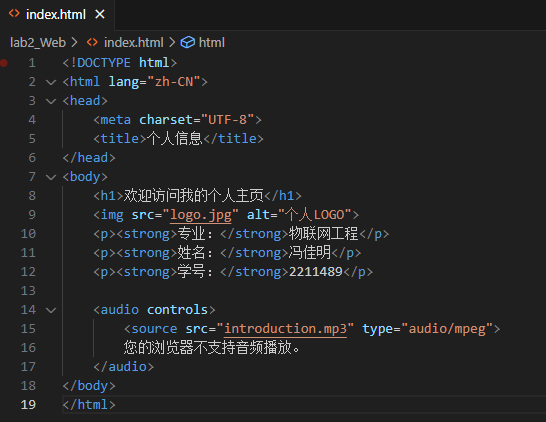

## 3. 访问WEB页面
在浏览器地址栏输入
http://127.0.0.1:8080 访问刚刚创建的Web页面。

页面效果如下图所示：
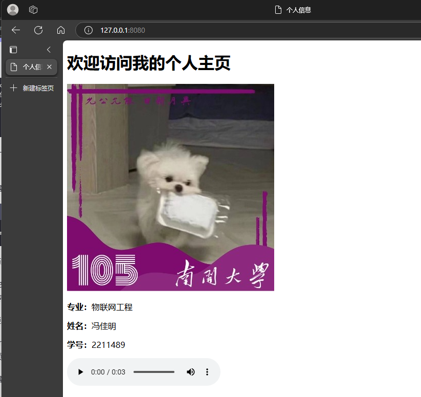

# 二、交互分析 

## 1. 准备工作
- 启动wireshark，选择
Adapter for loopback traffic capture接口 
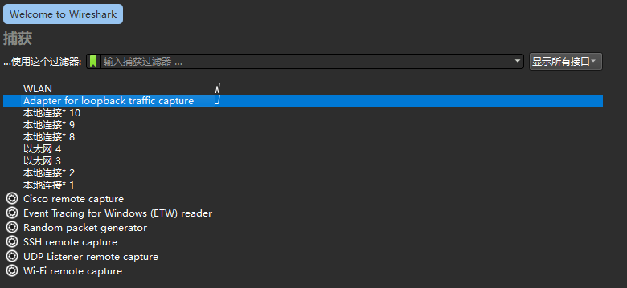
- 设置过滤器
(ip.dst == 127.0.0.1 or ip.src == 127.0.0.1) and 
(tcp.srcport == 8080 or tcp.dstport == 8080)

## 2. 抓包结果
运行一段时间后，得到的抓包结果如下图所示： 
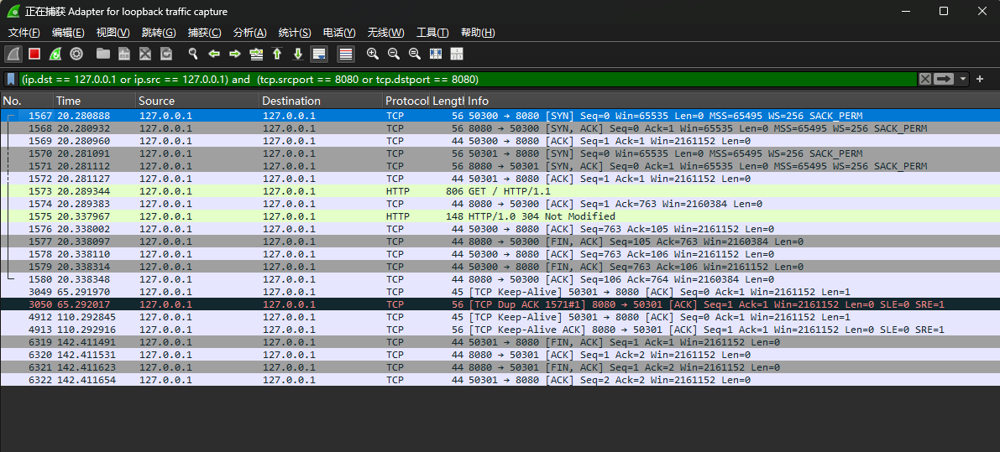

## 3. 详细分析

### TCP分析

- TCP的序号和确认号：
  - 32位序号 seq：是TCP通信过程中某一个传输方向上的字节流的每个字节的序号，通过这个来确认**发送的数据有序**，比如现在序列号为1000，发送了1000，下一个序列号就是2000。
  - 32位确认号 ack：是TCP对上一次seq序号做出的确认号，用来响应TCP报文段，给收到的TCP报文段的序号seq加1。

- TCP的标志位：每个TCP段都有一个目的，这是借助于TCP标志位选项来确定的，允许发送方或接收方指定哪些标志应该被使用，以便段被另一端正确处理。
  用的最广泛的标志是 SYN，ACK 和 FIN，用于建立连接，确认成功的段传输，最后终止连接。
  - SYN：同步标志位，用于建立会话连接，同步序列号
  - ACK：确认标志位，对已接收的数据包进行确认
  - FIN：完成标志位，表示已经没有数据要发送了，即将关闭连接

### TCP三次握手

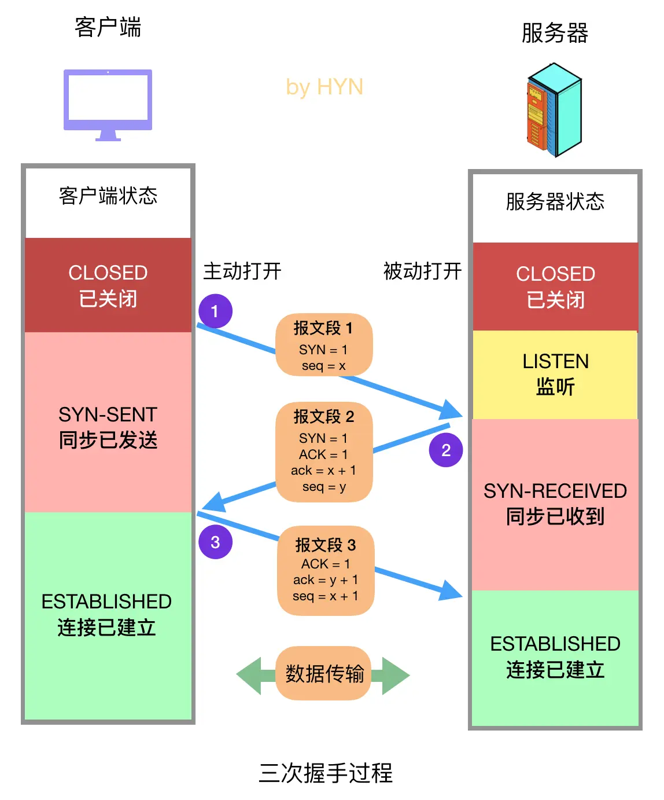

在wireshark中可以看到TCP三次握手的过程，如下图所示： 
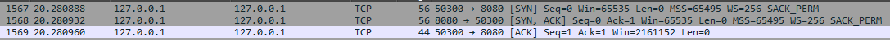

- **第一次握手：**  客户端向服务器端发送报文，证明客户端的发送能力正常。
  - 客户端首先创建传输控制块TCB，然后向服务器发出连接请求报文
  - 报文中设置标志位SYN=1，表示这是握手报文，并发送给服务器
  - 客户端处于SYN-SENT状态，等待服务器回应。 
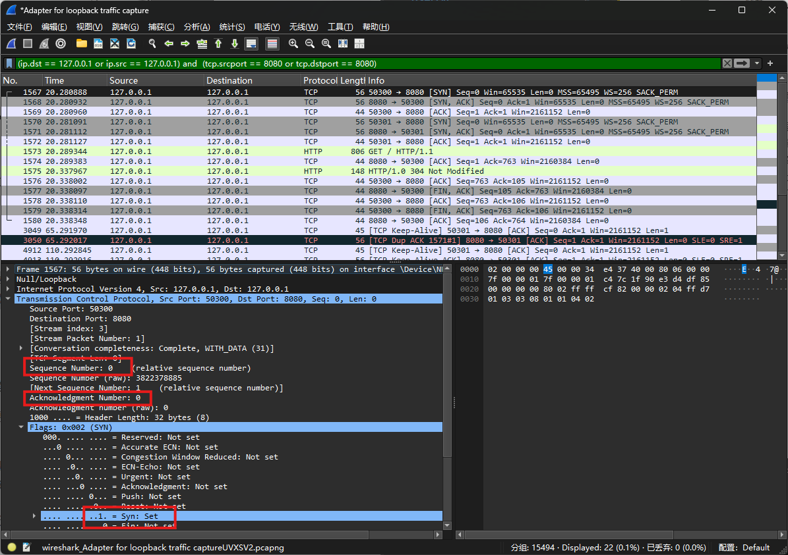

- **第二次握手：** 服务器端接收到报文并向客户端发送报文，证明服务器端的接收能力、发送能力正常。
  - 服务器收到请求报文后，如果同意连接，则会向客户端发出确认报文
  - 设置标志位SYN=1，表示这是握手报文，并发送给客户端
  - 确认报文中设置 ACK=1，表示确认应答
  - 确认号是ack=x+1，表示已收到客户端x之前的数据，希望下次数据从x+1开始
  - 同时设置发送的数据包序列号 seq=y
  - 服务器进入 SYN-RCVD 状态  
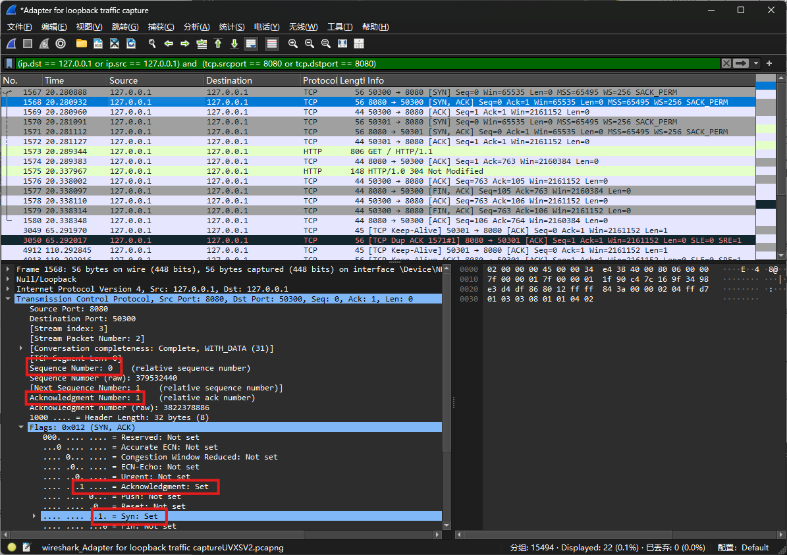

确认报文的ACK=1，ack=y+1，自己的序列号seq=x+1，此时，

- **第三次握手：** 客户端向服务器发送报文
证明客户端的接收能力正常。
  - 客户端收到服务器的确认报文后，向服务器发出确认
  - 报文中设置 ack=y+1，表示收到服务器发来的序列号为 seq=y 的数据包，希望下次数据从y+1开始
  - 设置seq=x+1，表示接着上一个数据包seq=x继续发送
  - 客户端进入ESTABLISHED，完成三次握手，TCP连接建立  
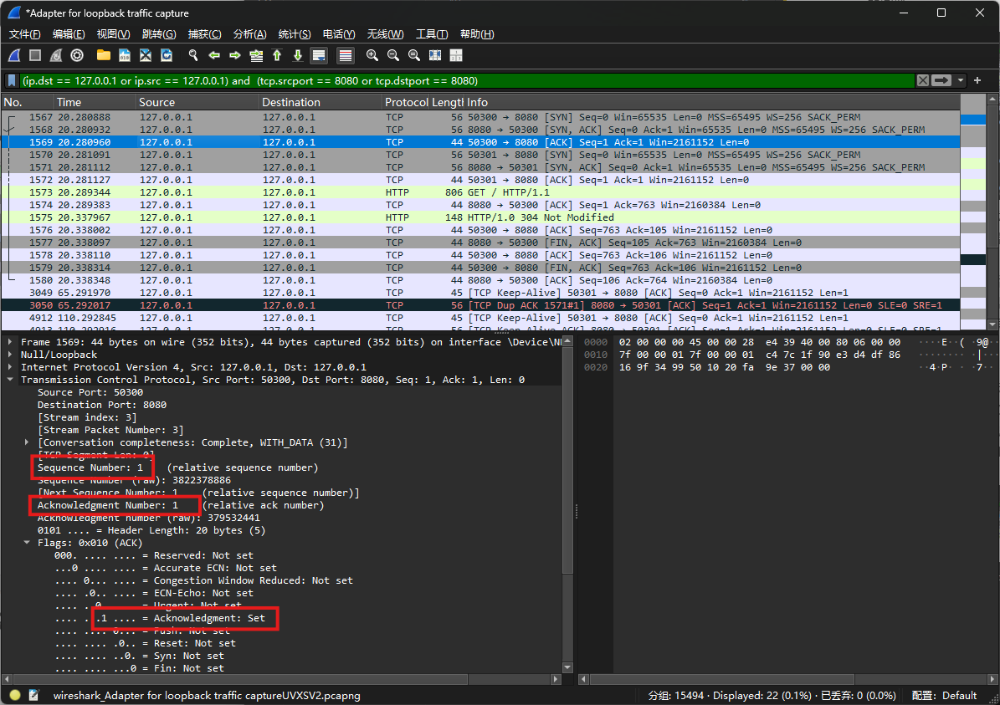

### HTTP请求报文

- 一个**HTTP请求报文**由请求行、请求头部、空行和请求包体4个部分组成。
  - **请求行**（Request line）：包括请求方法、URL和协议版本。
  **请求方法**（Request method）：表示要执行的操作，常见的方法有GET、POST、PUT、DELETE等。
  **URL**（Uniform Resource Locator）：表示要访问的资源路径。
  **协议版本**（Protocol version）：表示使用的HTTP协议版本，如HTTP/1.1。
  - **请求头部**（Request headers）：包括一些关于请求的额外信息，如User-Agent、Content-Type、Authorization等。
  - **请求体**（Request body）：用于传输请求的数据，对于GET请求来说，请求体通常为空。

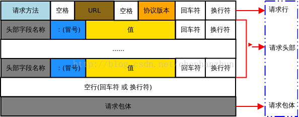

### HTTP响应报文

- 与HTTP请求类似，一个**HTTP响应报文**由状态行、响应头部、空行和响应包体4个部分组成。

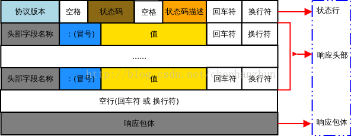

### 分析

- 客户端向服务器端发送请求：
  - 请求方法：GET
  - URL：/
  - 协议版本：HTTP/1.1 
  - 目标主机：127.0.0.1：8080
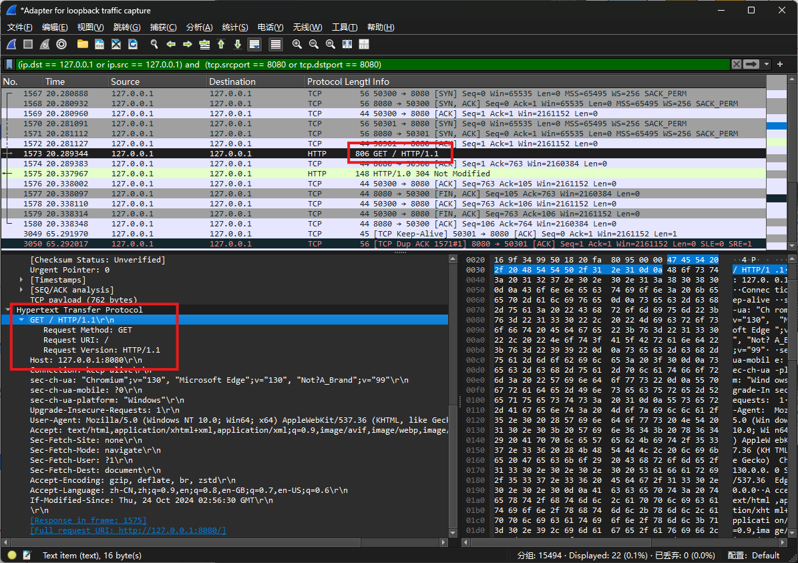

- 服务器端向客户端发送响应报文：
  - 协议版本：HTTP/1.0
  - 状态码：304 Not Modified，表示请求的资源自上次请求以来没有被修改。服务器使用这个状态码告诉客户端，资源没有变化，因此客户端可以继续使用它的缓存副本，而无需重新下载资源。

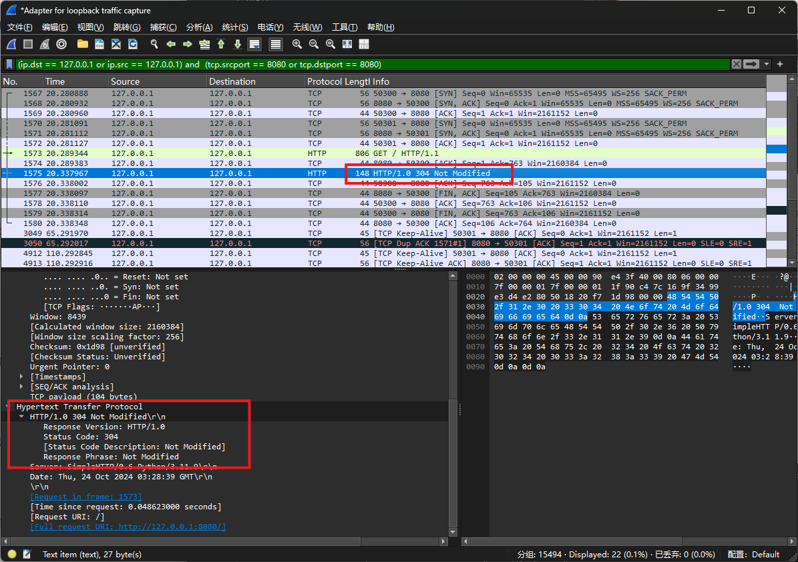

### TCP四次挥手

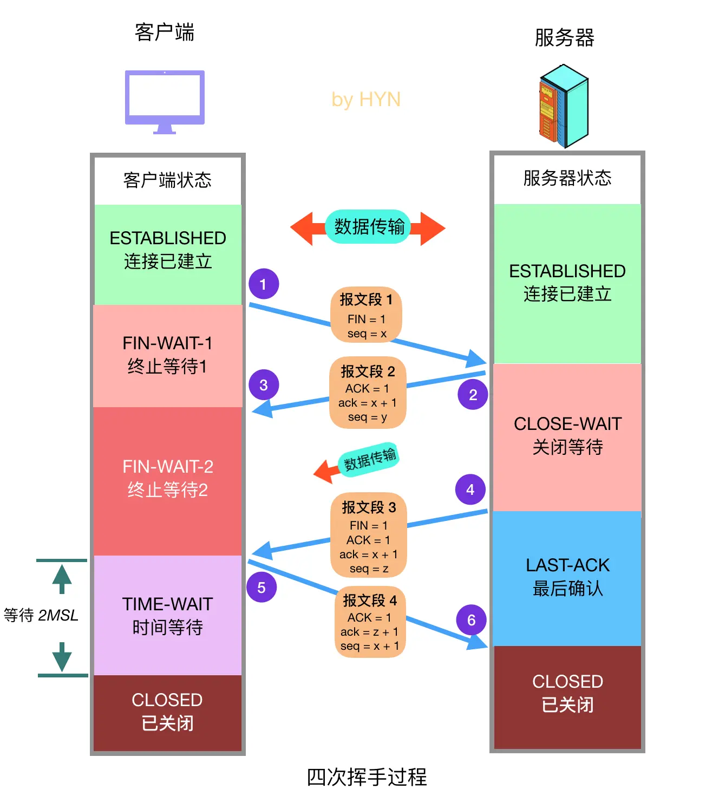

在wireshark中可以看到TCP四次挥手的过程，如下图所示： 
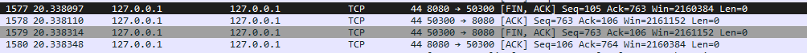

- **第一次挥手：** 客户端发送关闭连接的请求
  - 设置标志位FIN=1，请求关闭连接，并停止发送数据
  - 设置序号字段seq=x
  - 客户端进入FIN-WAIT-1状态

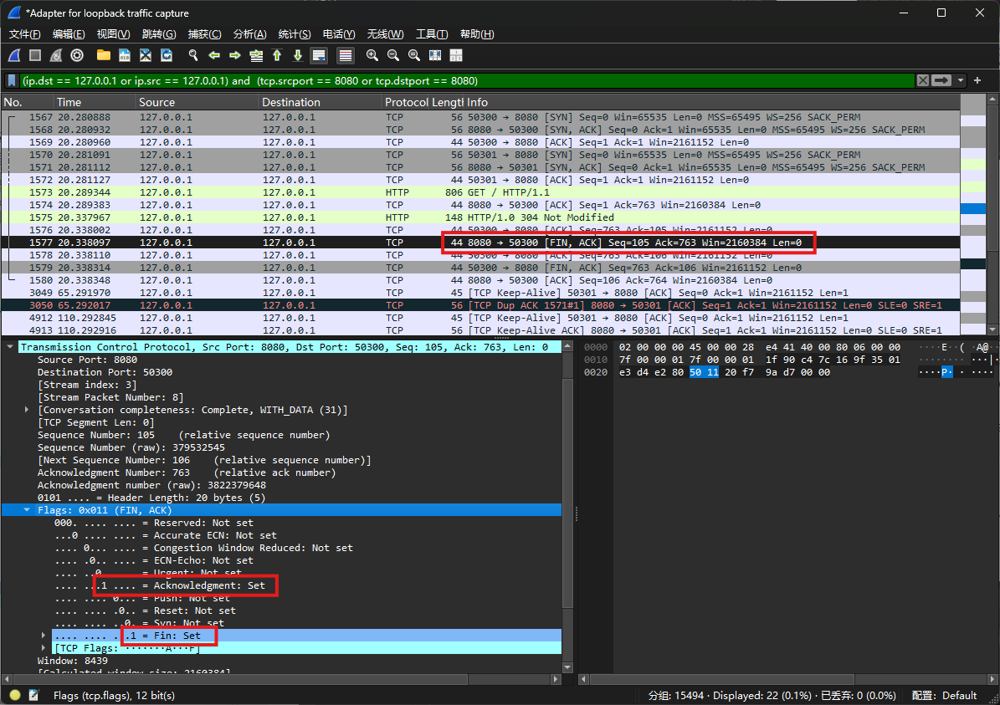

- **第二次挥手：** 服务器端收到请求，发回确认报文，同一关闭请求
  - 设置ACK = 1,
  - 服务器进入CLOSE-WAIT状态
  - 客户端进入FIN-WAIT-2状态

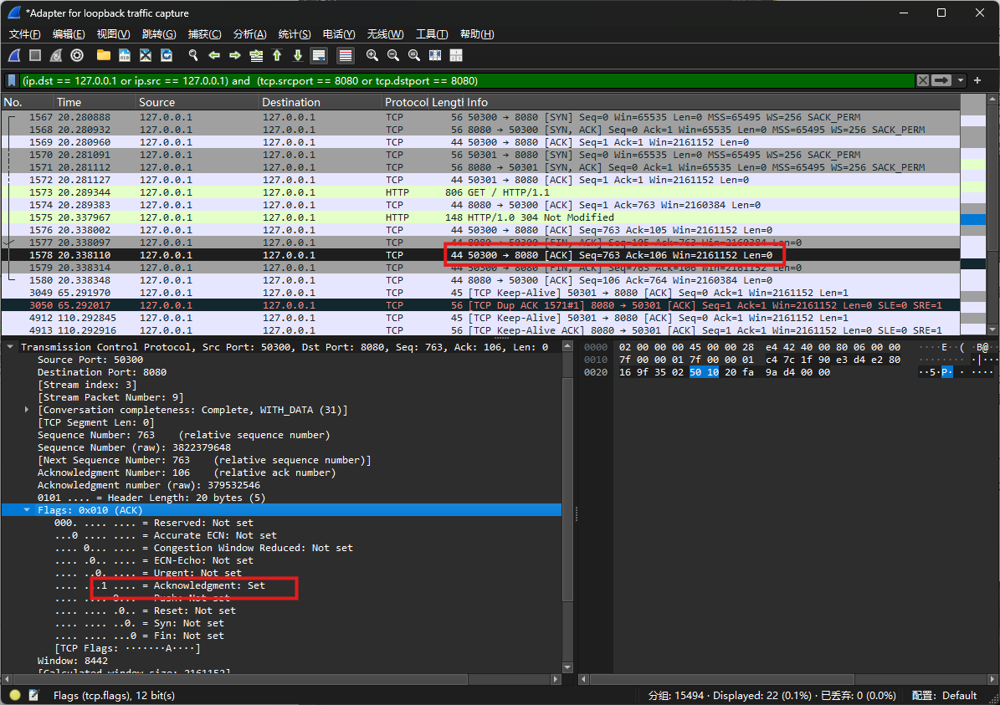

- **第三次挥手：** 服务器端将所有事项处理完成后，向客户端发送关闭连接请求
  - 服务器进入LAST-ACK状态

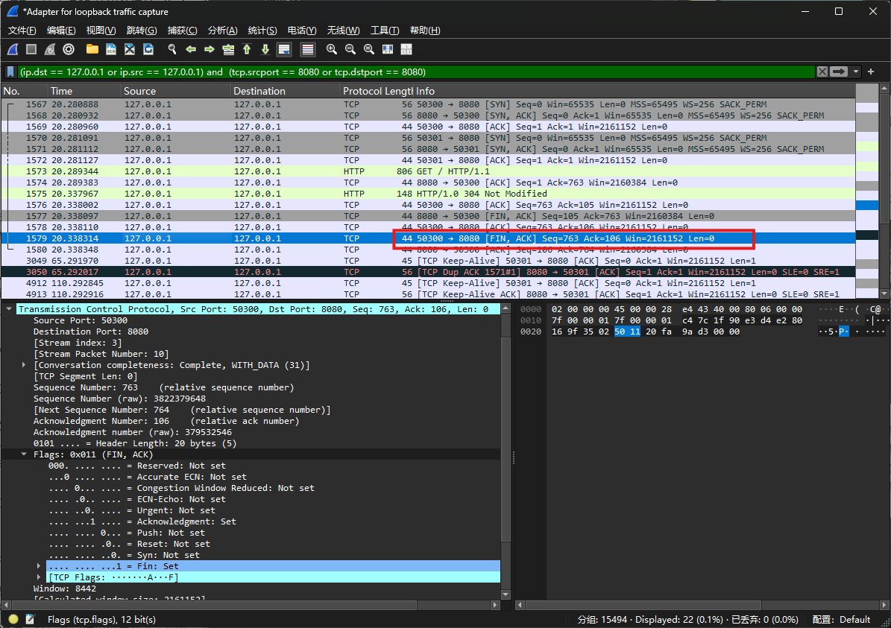

- **第四次挥手：** 客户端收到请求，向服务器发送 ACK 报文
  - 客户端进入 TIME-WAIT 状态
  - 服务器端接收到ACK报文后，进入CLOSED 状态
  - 客户端等待2MSL(两倍的报文段最大存活时间)， 若没有收到回复，则证明服务器端已关闭，客户端进入CLOSED状态

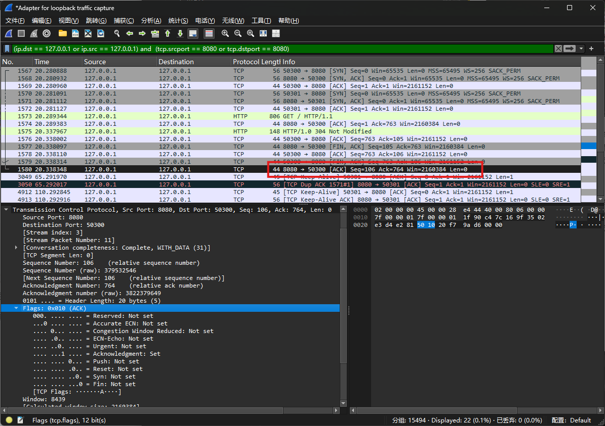

# 四、问题思考
1. 为什么是三次握手？
  三次握手的主要目的是为了确保双方的发送和接收能力都正常。
  在三次握手中，客户端发送SYN报文后，服务器发送SYN+ACK报文，客户端再发送一个ACK确认报文。这样可以确保客户端不仅能发送数据，也能接收数据。如果只有两次握手，服务器无法确认客户端是否能接收其发送的报文。
  如果只有两次握手，若遇到网络情况不好时，客户端发送的第一个SYN报文在长时间延迟后到达服务器，服务器可能会误认为这是一个新的连接请求，并据此分配资源。三次握手则可以避免这种情况，因为客户端在接收到SYN+ACK报文后，如果发现该连接请求已经不再需要，就不会发送ACK确认报文，这样就不会占用服务器资源。

2. 为什么是四次挥手？
  四次挥手是为了确保TCP连接的双方能够安全地关闭连接，并处理完所有未完成的数据传输。

3. 为什么客户端要等待2MSL再进入CLOSE状态？
  如果客户端立即关闭连接而不等待，服务器可能因为网络延迟等原因没有收到客户端的ACK，导致服务器重发FIN报文。通过等待2MSL的时间，可以确保服务器有足够的时间收到客户端的ACK，避免不必要的重传。