# <center>计算机网络实验报告</center>
## <center>LAB3-2 基于 UDP 服务设计可靠传输协议并编程实现</center>
## <center>网络空间安全学院 物联网工程</center>
## <center>2211489 冯佳明</center>

# 实验要求
在实验3-1的基础上，将停等机制改成基于滑动窗口的流量控制机制，发送窗口和接收窗口采用相同大小，支持累积确认，完成给定测试文件的传输.

# 一、协议设计

## （一）数据包格式

1. tcp与udp比对

> **传输控制协议TCP：** 为进程间通信提供面向连接的、可靠的传输服务；实现复用分用、差错检测、确认重传、流量控制等传输层功能</br>
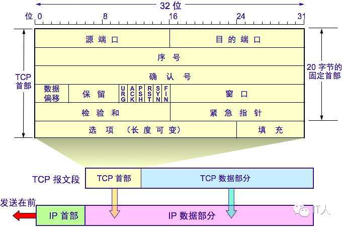

> **用户数据报协议UDP：** 为进程间通信提供非连接的、不可靠的传输服务；实现复用分用、差错检测的传输层功能</br>
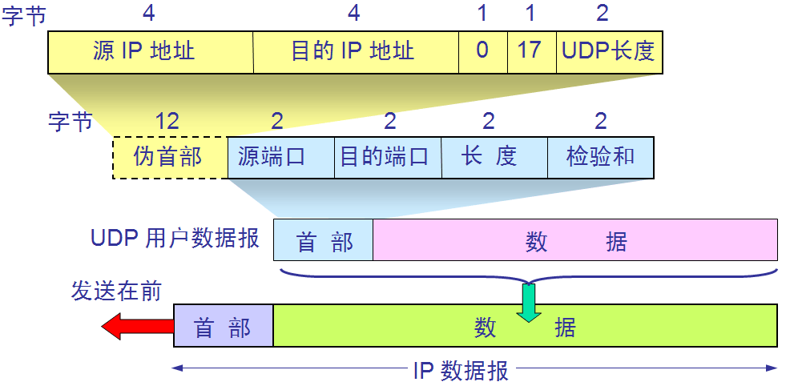

为了基于UDP建立面向连接的可靠的传输服务，可以仿照TCP进行协议设计

2. **报文设计：** 仿照tcp报文进行设计

其中，TCP报文中各个标志位的含义如下，在我的设计中，仅保留SYN,ACK,FIN三个标志位
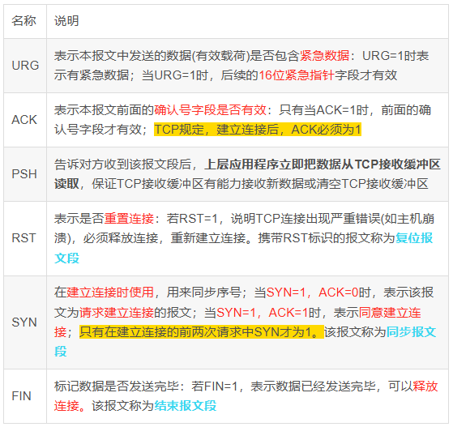

最终报文设计如下所示，SYN,ACK,FIN三个标志位各占1位
> 与lab3-1有所不同，在此处增加了**offset**位，代表该端报文在原文件中的位置，以1024B为单位

报文头部共28Byte，数据段最大为10240Byte，整个数据报最大为为1024+28=1052Byte</br>
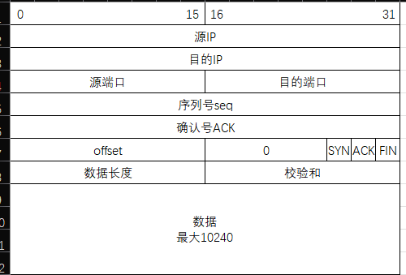

3. **滑动窗口设计：** 发送窗口大小为21，接收窗口大小为1.

## （二）交互设计

1. **建立连接：** 仿照TCP协议设计，通过**三次握手**建立连接，示意图如下：</br>


2. **差错检测：** 为了保证数据传输的可靠性，本次实验仿照 UDP 的校验和机制设计了差错检测机制。对消息头部和数据的所有16位字求和，然后对结果取反。算法原理同理论课讲述，在此不再赘述。

3. **接收确认：** 按照实验要求，本实验使用**GBN滑动窗口**协议，支持**累计确认**。
在发送端，为了避免多线程导致的冲突，定义了基于原子操作的 base 与 next_seq，用于标定窗口的位置。

- 发送的数据包会被保存在发送端缓冲区 send_buffer 中。
- 发送方会等待确认报文，确认其数据包是否被接收。如果确认报文的 ack_num 与预期的相符，发送方就更新窗口，移动 base，表示该数据包已经成功被接收。
- 如果接收方长时间没有确认某个数据包，或者接收到的确认报文不是预期的（例如 ACK 超时），发送方会重新发送该数据包。如果收到重复确认达到 3 次，就触发快速重传机制。
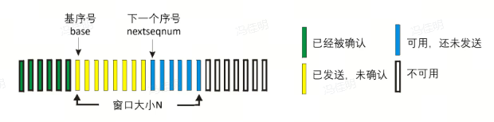

4. **超时重传：** 本次实验实现了超时重传功能以避免数据包丢失问题。发送端每次发送数据包后立刻开始计时，如果等待时间超过设置的超时时间TIMEOUT_MS时，仍没有收到来自接收端的ACK确认报文，则重新发送数据包。

5. **断开连接：** 仿照TCP协议设计，通过**四次挥手**断开连接，示意图如下：</br>
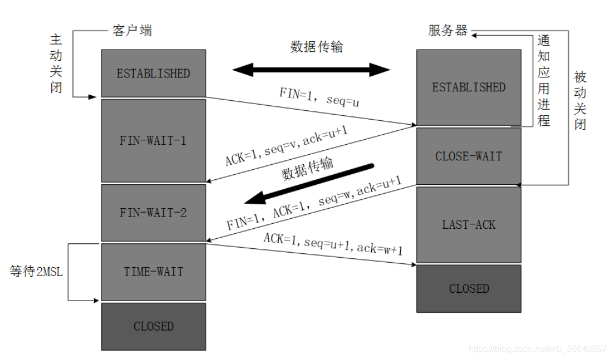

1. **状态机设置：** 
   - **发送端：**</br>
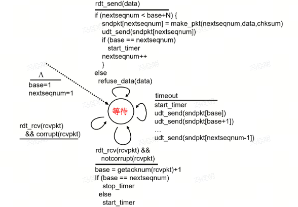

   - **接收端：** </br>
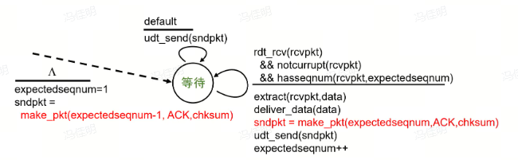

# 二、代码实现

## （一）协议设计

对标志位进行宏定义，便于后续使用；

```cpp{.line-numbers}
#define SYN_FLAG 0x01
#define ACK_FLAG 0x02
#define FIN_FLAG 0x04
```

将报文分装成Packet结构体，并编写相关函数，用于初始化结构体、设置标志位、判断标志位、差错检测、打印输出；

```cpp{.line-numbers}
struct Packet {
    uint32_t src_ip;      // 源IP地址
    uint32_t dest_ip;     // 目的IP地址
    uint16_t src_port;    // 源端口
    uint16_t dest_port;   // 目的端口
    uint32_t seq_num;     // 序列号
    uint32_t ack_num;     // 确认号
    uint16_t offset;      // 偏移量
    uint16_t flags;       // 标志位（SYN, ACK, FIN）
    uint16_t data_len;    // 数据长度
    uint16_t checksum;    // 校验和
    char data[MAX_DATA_LENGTH]; // 数据内容

    Packet() : src_ip(0), dest_ip(0), src_port(0), dest_port(0),
        seq_num(0), ack_num(0), offset(0), flags(0), data_len(0), checksum(0) {
        memset(this->data, 0, MAX_DATA_LENGTH);
    }

    void compute_checksum();
    uint16_t check_checksum();
    void Print_Message();

    // 设置标志位
    void set_SYN() {
        this->flags |= SYN_FLAG;
    }
    void set_ACK() {
        this->flags |= ACK_FLAG;
    }
    void set_FIN() {
        this->flags |= FIN_FLAG;
    }
    
    // 判断标志位
    int is_SYN() {
        return (this->flags & SYN_FLAG) ? 1 : 0;
    }
    int is_ACK() {
        return (this->flags & ACK_FLAG) ? 1 : 0;
    }
    int is_FIN() {
        return (this->flags & FIN_FLAG) ? 1 : 0;
    }
};
```

依据理论课讲授的原理，实现对校验和的设置与检测功能；

```cpp{.line-numbers}
// 计算校验和
void Packet::compute_checksum() {
    uint32_t sum = 0;
    uint16_t* data_ptr = reinterpret_cast<uint16_t*>(this); // 将结构体数据转换为16位的指针

    // 遍历Packet结构体的每个16位（2字节）段
    size_t total_size = sizeof(Packet) / 2; // sizeof(Packet) 可能是偶数长度
    for (size_t i = 0; i < total_size; ++i) {
        sum += data_ptr[i];

        // 处理溢出：将高16位加到低16位
        if (sum > 0xFFFF) {
            sum = (sum & 0xFFFF) + (sum >> 16);
        }
    }

    // 如果结构体大小为奇数，额外处理最后1字节（补充为0）
    if (sizeof(Packet) % 2 != 0) {
        sum += reinterpret_cast<uint8_t*>(this)[sizeof(Packet) - 1] << 8;
        if (sum > 0xFFFF) {
            sum = (sum & 0xFFFF) + (sum >> 16);
        }
    }

    // 反转位并存储结果（校验和）
    this->checksum = static_cast<uint16_t>(~(sum & 0xFFFF)); 
}

// 检查校验和
uint16_t Packet::check_checksum() {
    uint32_t sum = 0;
    uint16_t* data_ptr = reinterpret_cast<uint16_t*>(this); // 将结构体数据转换为16位的指针

    // 遍历Packet结构体的每个16位（2字节）段
    size_t total_size = sizeof(Packet) / 2; // sizeof(Packet) 可能是偶数长度
    for (size_t i = 0; i < total_size; ++i) {
        sum += data_ptr[i];

        // 处理溢出：将高16位加到低16位
        if (sum > 0xFFFF) {
            sum = (sum & 0xFFFF) + (sum >> 16);
        }
    }

    // 如果结构体大小为奇数，额外处理最后1字节（补充为0）
    if (sizeof(Packet) % 2 != 0) {
        sum += reinterpret_cast<uint8_t*>(this)[sizeof(Packet) - 1] << 8;
        if (sum > 0xFFFF) {
            sum = (sum & 0xFFFF) + (sum >> 16);
        }
    }

    // 反转位并存储结果（校验和）
    return static_cast<uint16_t>(sum & 0xFFFF); 
}
```

## （二）初始化

发送端与接收端的结构相同，此处以发送端为例进行说明。

对使用的IP地址、端口、套接字进行声明；

```cpp{.line-numbers}
//#define recv_Port 5555    
#define recv_Port 1111    //router
#define send_Port 6666

SOCKET recv_Socket;
SOCKADDR_IN recv_Addr;
//string recv_IP = "127.0.0.3";
string recv_IP = "127.0.0.2";   //router
int recv_AddrLen = sizeof(recv_Addr);

SOCKET send_Socket;
SOCKADDR_IN send_Addr;
string send_IP = "127.0.0.1";
int send_AddrLen = sizeof(send_Addr);
```

编写send_Initial函数，按照UDP架构对套接字进行初始化；

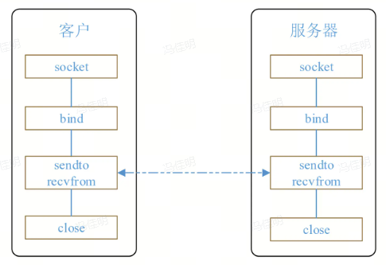

```cpp{.line-numbers}
void send_Initial()
{
    // 初始化WinSock
    WSADATA wsaData;
    if (WSAStartup(MAKEWORD(2, 2), &wsaData) != 0) {
        perror("[Send] 初始化Socket DLL失败！\n");
        exit(EXIT_FAILURE);
    }
    else
    {
        cout << "[Send] 初始化Socket DLL成功！" << endl;
    }

    // 创建 UDP 套接字
    send_Socket = socket(AF_INET, SOCK_DGRAM, 0);
    if (send_Socket == INVALID_SOCKET) {
        perror("[Send] 创建socket失败！\n");
        exit(EXIT_FAILURE);
    }
    else
    {
        cout << "[Send] 创建socket成功！" << endl;
    }

    // 设置非阻塞模式
    unsigned long on = 1;
    ioctlsocket(send_Socket, FIONBIO, &on);

    // 配置发送端地址
    send_Addr.sin_family = AF_INET;
    send_Addr.sin_port = htons(send_Port);
    if (inet_pton(AF_INET, send_IP.c_str(), &send_Addr.sin_addr) <= 0) {
        cerr << "[Send] 无效的发送端IP地址！" << endl;
        closesocket(send_Socket);
        WSACleanup();
        exit(EXIT_FAILURE);
    }

    // 绑定套接字
    if (bind(send_Socket, (sockaddr*)&send_Addr, sizeof(SOCKADDR)) == SOCKET_ERROR) {
        cerr << "[Send] 绑定socket失败！" << endl;
        closesocket(send_Socket);
        WSACleanup();
        exit(EXIT_FAILURE);
    }

    // 配置路由器地址
    recv_Addr.sin_family = AF_INET;
    recv_Addr.sin_port = htons(recv_Port);
   if (inet_pton(AF_INET, recv_IP.c_str(), &recv_Addr.sin_addr) <= 0) {
        cerr << "[Send] 无效的接收端IP地址！" << endl;
        closesocket(send_Socket);
        WSACleanup();
        exit(EXIT_FAILURE);
    }

    cout << "[Send] 初始化并且绑定socket成功！" << endl;
}

```

## （三）三次握手建立连接

### 1. 发送端

- 设置第一次握手消息并发送
  - 若发送成功，开始计时
- 等待接受第二次握手消息
  - 超时未收到第二次握手的消息，重新发送第一次握手消息，最多重发三次
  - 收到第二次握手消息且保温正确后，发送第三次握手消息
- 第三次握手消息发送成功，成功建立连接

```cpp{.line-numbers}
int Connect()
{
    // 设置第一次握手的数据包参数
    wo1.set_SYN();  // 设置SYN=1，表示希望建立连接
    wo1.seq_num = ++in_seq; //seq初始化为in_seq+1

    int resend_count = 0;
    bool connected = false;

    while (resend_count < MAX_RETRIES && !connected)
    {
        if (SEND(wo1) > 0)
        {
            float wo1_send_clock = clock();
            cout << "[Send] 发送第一次握手的SYN报文" << endl;
            wo1.Print_Message();

            while (1)
            {
                // 接收到了第二次握手的报文
                if (recvfrom(send_Socket, (char*)&wo2, sizeof(wo2), 0, (SOCKADDR*)&recv_Addr, &recv_AddrLen) > 0)
                {
                    // 接收到的报文是正确的
                    // 接收到的报文wo2应为：SYN = 1，ACK = 1，Ack_num = seq_num+1= 2，校验和=0xffff
                    if (wo2.is_SYN() && wo2.is_ACK() && (wo2.ack_num == (wo1.seq_num + 1))
                        && wo2.check_checksum() == 0xffff)
                    {
                        cout << "[Send] 第二次握手成功！" << endl;
                        

                        // 设置第三次握手报文，ACK = 1， wo3.seq_num = wo2.ack_num
                        // wo3.ack_num = wo2.seq_num + 1
                        wo3.set_ACK();
                        wo3.seq_num = ++in_seq;
                        wo3.ack_num = wo2.seq_num + 1;
                        
                        int wo3_send_count = 0;
                        int ack_send_res = -1;
                        // 发送第三次握手的报文
                        while (wo3_send_count < MAX_RETRIES && ack_send_res < 0)
                        {
                            ack_send_res = SEND(wo3);
                            
                            
                            // 如果第三次握手的报文发送成功
                            if (ack_send_res > 0)
                            {
                                cout << "[Send] 发送第三次握手的ACK报文" << endl;
                                wo3.Print_Message();
                                connected = true;  // 三次握手成功，连接建立
                                cout << "[Send] 三次握手建立成功！" << endl;
                                return 1;
                            }
                            // 如果第三次报文发送失败，重新发，最多三次
                            else
                            {
                                cout << "[Send] 第三次握手发送ACK失败，重试次数：" << wo3_send_count + 1 << endl;
                                wo3_send_count++;
                                if (wo3_send_count < 3)
                                {
                                    cout << "[Send] 正在重新发送ACK报文..." << endl;
                                }
                                else
                                {
                                    cout << "[Send] 已重试三次，第三次握手失败！" << endl;
                                }
                            }
                        }
                        if (wo3_send_count == MAX_RETRIES && ack_send_res < 0)
                        {
                            cout << "[Send] 无法成功发送第三次握手ACK报文，连接失败。" << endl;
                            exit(EXIT_FAILURE);
                        }
                        break;
                    }

                    // 接收到的第二次握手报文是错误的
                    else
                    {
                        cout << "[Send] 第二次握手错误！收到不合法的报文" << endl;
                        break;
                    }
                }

                // 如果超时
                if (clock() - wo1_send_clock > TIMEOUT_MS)
                {
                    resend_count++;
                    cout << "[Send] 超时，正在重新发送第一次握手的SYN报文，重试次数：" << resend_count << endl;
                    break; 
                }
            }
        }

        // 第一次握手报文发送失败
        else 
        {
            cout << "[Send] 发送第一次握手的SYN报文失败！" << endl; 
            break;
        }
    }

    // 重试了三次，连接失败
    if (!connected)
    {
        cout << "[Send] 三次握手失败，建立连接失败！" << endl;
        exit(EXIT_FAILURE);
    }

    return 0;
}

```

### 2. 接收端

- 等待接收第一次握手消息
  - 若报文正确，设置第二次握手消息
- 发送第二次握手消息
- 等待接收第三次握手消息
  - 收到第三次握手消息且报文正确后，成功建立连接

```cpp{.line-numbers}
int Connect()
{
    // 接收来自发送端的，第一次握手的报文
    while (1) {
        // 接收到第一次握手的报文了
        if (recvfrom(recv_Socket, (char*)&wo1, sizeof(wo1), 0, (SOCKADDR*)&send_Addr, &send_AddrLen) > 0)
        {
            cout << "[Recv] 收到第一次握手的SYN报文" << endl;
            wo1.Print_Message();

            // 检查第一次握手的报文是否正确
            // 理论上，SYN = 1，校验和=0xffff
            if (wo1.is_SYN() && wo1.check_checksum() == 0xffff)
            {
                // 第一次数据包接收到的是正确的，发送第二次握手的数据包
                // 设置wo2，SYN = 1，ACK = 1，
                // wo2.ack_num=wo1.seq_num+1, wo2.seq_num=in_seq+1
                wo2.set_SYN();
                wo2.set_ACK();
                wo2.ack_num = wo1.seq_num + 1;
                wo2.seq_num = ++in_seq;
                
                // 发送第二次数据包成功
                if (SEND(wo2) > 0)
                {
                    
                    cout << "[Recv] 发送第二次握手的SYN-ACK报文" << endl;
                    wo2.Print_Message();

                    // 发送第二次数据包成功，等待接收第三次握手的数据包
                    while (1)
                    {
                        // 成功接收到第三次握手的数据包
                        if (recvfrom(recv_Socket, (char*)&wo3, sizeof(wo3), 0, (SOCKADDR*)&send_Addr, &send_AddrLen) > 0)
                        {
                            cout << "[Recv] 收到第三次握手的报文" << endl;
                            wo3.Print_Message();
                            // 接收到的报文是正确的
                            // 接收到的报文wo3应为：ACK = 1，wo3.Ack_num = wo2.seq_num+1，
                            // wo3.seq_num=wo2.ack_num，校验和=0xffff
                            if (wo3.is_ACK() && (wo3.ack_num == (wo2.seq_num + 1))
                                && wo3.check_checksum() == 0xffff)
                            {
                                cout << "[Recv] 三次握手建立成功！" << endl;
                                return 1;
                            }

                            // 接收到的报文非法
                            else
                            {
                                cout << "[Recv] 第三次握手错误！收到不合法的报文" << endl;
                                break;
                            }
                        }
                    }
                }

                // 发送第二次数据包不成功
                else
                {
                    cout << "[Recv] 发送第二次握手的SYN-ACK报文失败！" << endl;
                    break;
                }
            }

            // 第一次握手的报文非法
            else
            {
                cout << "[Recv] 第一次握手错误！收到不合法的报文" << endl;
                cout << wo1.check_checksum() << endl;
                break;
            }
        }
    }
    
    return 0;
}

```

## （四）数据传输

为了使代码的可读性更高，并避免代码冗余，将消息发送封装成为SEND函数

```cpp{.line-numbers}
int SEND(Packet &packet)
{
    inet_pton(AF_INET, send_IP.c_str(), &packet.src_ip);
    inet_pton(AF_INET, recv_IP.c_str(), &packet.dest_ip);
    packet.src_port = send_Port;
    packet.dest_port = recv_Port;
    packet.compute_checksum();
    
    int result = sendto(send_Socket, (char*)&packet, sizeof(packet), 0, (SOCKADDR*)&recv_Addr, sizeof(recv_Addr));
    if (result == SOCKET_ERROR) {
        int error = WSAGetLastError();
        cout << "[Send] sendto failed with error: " << error << endl;
    }

    // sendto参数：socket描述符，发送数据缓存区，发送缓冲区的长度，
    // 对调用的处理方式，目标socket的地址，目标地址的长度
    return result;
}
```

### 1. 发送端

在send.h中定义窗口大小WINDOW_SIZE

```cpp{.line-numbers}
// 窗口大小
#define WINDOW_SIZE 21
```

为了避免多线程引起的数据读写冲突，定义了一系列基于原子操作的操作数，同时也定义了一个 mutex 用于控制输出。

```cpp{.line-numbers}
atomic_int base(0);     // 窗口的基序列号
atomic_int next_seq(0); // 下一个要发送的数据包序列号
int begin_seq;
atomic_int Count(0);
mutex mtx;  // 互斥锁
int need_resend = false;
int finish = false;
```

编写**send_file**函数用于发送文件数据，根据接收到的确认报文进行滑动窗口管理，实现丢包重传机制，快速重传丢失的数据包。

编写**recv_thread**函数接收确认报文并处理，识别重复的确认报文，设置重传标志位，判断文件是否传输完毕。

- send_file函数：
  - 根据输入的路径寻找文件，以二进制方式读取文件，获取文件大小及文件名等信息并输出；
  - 构造一个含文件头部信息的数据包，将文件名和文件大小的字符串作为头部信息进行传输；
  - 用封装好的SEND函数发送头部信息，发送成功后启动计时器，等待头部确认报文；
  - 如果超时未收到头部确认，则重新发送头部信息，若收到合法的报文，则跳出循环，准备发送文件内容

```cpp{.line-numbers}
    ifstream file(file_path, ios::binary);

    // 获取文件名
    size_t pos = file_path.find_last_of("\\/");
    file_name = file_path.substr(pos + 1);

    if (!file.is_open()) {
        cout << "    打开文件" << file_name << "失败!" << endl;
        exit(EXIT_FAILURE);
    }

    // 获取文件大小
    file.seekg(0, ios::end);  // 移动文件指针到文件末尾
    file_length = static_cast<uint32_t>(file.tellg());  // 获取文件大小（字节）
    file.seekg(0, ios::beg);  // 重置文件指针到文件开头

    cout << "    文件" << file_name << "大小为" << file_length << "字节" << endl;

    // 发送一个数据包，表示文件头
    // 数据内容是文件的名称，以及文件的长度，设置send_head.seq_num=in_seq+1
    Packet send_head;

    //文件名 + 文件大小
    string data_to_send = file_name + " " + to_string(file_length);
    strcpy_s(send_head.data, sizeof(send_head.data), data_to_send.c_str());
    send_head.data[strlen(send_head.data)] = '\0';
    // 设置data_len为data的实际长度
    send_head.data_len = static_cast<uint16_t>(data_to_send.length());
    send_head.seq_num = ++in_seq;

    cout << "[Send] 发送" << file_name << "的头部信息" << endl;
    SEND(send_head);
    send_head.Print_Message();

    // 记录发送时间
    float send_head_time = clock();
    float start_time = clock();

    // 等待返回确认报文
    while (1)
    {
        Packet re_head;

        // 接收到了头部的确认报文
        if (recvfrom(send_Socket, (char*)&re_head, sizeof(re_head), 0, (SOCKADDR*)&recv_Addr, &recv_AddrLen) > 0)
        {
            // 检查接收到的确认数据包是否正确
            // 理论上应该是 ACK = 1，re_head.ack_num = send_head.ack_num+1，
            // 校验和无错
            if (re_head.is_ACK() && (re_head.ack_num == (send_head.seq_num + 1))
                && re_head.check_checksum() == 0xffff)
            {
                break;
            }

            // 数据包不对
            else
            {
                cout << "[Send] 收到不合法的报文" << endl;
                re_head.Print_Message();
                break;
            }
        }

        // 如果未接收到确认报文-超时
        if (clock() - send_head_time > TIMEOUT_MS)
        {
            // 重新发送
            int result = sendto(send_Socket, (char*)&send_head, sizeof(send_head), 0, (SOCKADDR*)&recv_Addr, sizeof(recv_Addr));

            if (result > 0)
            {
                cout << "[Send] 接收头部确认报文超时，正在重新发送" << file_name << "的头部信息" << endl;
                send_head.Print_Message();
                // 重新发送后继续接收确认报文
                send_head_time = clock();  // 重置发送时间
                continue;  // 继续等待确认报文
            }

            else
            {
                cout << "[Send] 接收头部确认报文超时，重新发送" << file_name << "的头部信息失败！" << endl;
                exit(EXIT_FAILURE);
            }
        }
    }
```

- send_file函数：
  - 初始化文件传输，计算文件总共需要分成多少个数据包；
  - 启动接收线程，用来接收确认报文，并进行相关的处理操作；
  - 发送文件数据，如果finish标志为true，则说明文件发送完毕，终止发送；
  - 若need_resend标志为true，则代表出现丢包，借助发送端缓冲区send_buffer进行快速重传；
  - 根据窗口大小及当前包的序号，依次发送文件内容，每发送一个数据包，更新base与next_seq；
  - 打印窗口状态

```cpp{.line-numbers}
    need_packet_num = file_length / MAX_DATA_LENGTH;    // 需要发送的数据包个数
    last_length = file_length % MAX_DATA_LENGTH;        // 剩余的
    
    send_buffer.resize(static_cast<std::vector<Packet, std::allocator<Packet>>::size_type>(need_packet_num) + 1);  // 调整大小为 need_packet_num

    // 启动接收线程
    thread recv_thread_obj(recv_thread);

        while (!finish)
    {
        // 重新发送
        if (need_resend && (next_seq <= need_packet_num + 1))
        {
            // base = 179，next=181，丢179，重发179，180，181
            for (int i = base; i < next_seq; i++)
            {
                lock_guard<mutex> lock(mtx);

                Packet re_send;
                re_send = send_buffer[i];

                int data_len = strlen(send_buffer[i].data);  // 获取源数据的实际长度
                if (data_len > MAX_DATA_LENGTH) {
                    cout << "data_len = " << data_len << endl;
                    cout << "[Error] 数据太大，无法复制！" << endl;
                    exit(EXIT_FAILURE);  // 如果数据太大，可以根据实际情况处理错误
                }

                if (SEND(re_send) > 0)
                {
                    cout << "[Send] 重新发送  [" << file_name << "]" << re_send.offset << "/" << need_packet_num << endl;
                    re_send.Print_Message();                    

                    float re_clock = clock();
                    while (1)
                    {
                        if (clock() - re_clock > 1)
                        {
                            break;
                        }
                    }

                    time_send_file = clock();
                }
                else
                {
                    cout << "[Send] 重新发送  [" << file_name << "]" << re_send.offset << "/" << need_packet_num << "失败！" << endl;
                    exit(EXIT_FAILURE);
                }
            }

            need_resend = false;
        }

        if (next_seq <= need_packet_num && next_seq < base + WINDOW_SIZE)
        {
            // 读取数据并填充数据包
            Packet file_send;
            if (next_seq < need_packet_num)
            {
                lock_guard<mutex> lock(mtx);

                // 读取数据内容，设置数据包
                file.read(file_send.data, MAX_DATA_LENGTH);
                file_send.data_len = MAX_DATA_LENGTH;
                file_send.seq_num = ++in_seq;
                file_send.ack_num = file_send.seq_num - 1;
                file_send.offset = next_seq;

                strcpy_s(send_buffer[next_seq].data, MAX_DATA_LENGTH, file_send.data);

                send_buffer[next_seq] = file_send;
            }

            else if (next_seq == need_packet_num)
            {
                lock_guard<mutex> lock(mtx);

                // 读取数据内容，设置数据包
                file.read(file_send.data, last_length);
                file_send.data_len = last_length;
                file_send.seq_num = ++in_seq;
                file_send.ack_num = file_send.seq_num - 1;
                file_send.offset = next_seq;

                send_buffer[need_packet_num] = file_send;
            }

            // 数据发送成功
            if (SEND(file_send) > 0)
            {
                lock_guard<mutex> lock(mtx);

                // 记录发送时间
                time_send_file = clock();

                cout << "[Send] 发送  [" << file_name << "]" << file_send.offset << "/" << need_packet_num << endl;
                file_send.Print_Message();
                cout << " [Window] 当前 base = " << base << " ，next_seq = " << next_seq << endl;
                cout << endl;

                next_seq++;
            }
        }
    }

    // 等待接收线程结束
    recv_thread_obj.join();
```

- send_file函数：
  - 文件传输完毕后，关闭文件；
  - 计算文件传输总时间、文件传输吞吐率
  - 重置相关操作数；

```cpp{.line-numbers}
    // 结束时间
    float end_time = clock();

    // 计算传输时间
    float transfer_time = (end_time - start_time) * 1000 / CLOCKS_PER_SEC;  // 转换为毫秒
    cout << "[Send] 文件传输总时间: " << transfer_time << " 毫秒" << endl;

    // 计算吞吐率
    float throughput = static_cast<float>(file_length) / transfer_time;  // 单位：字节/毫秒
    float throughput_bps = throughput * 8;  // 单位：比特/毫秒
    cout << "[Send] 文件传输吞吐率: " << throughput_bps << " 比特/毫秒" << endl;

    file.close();

    lock_guard<mutex> lock(mtx);
    next_seq = 0;
    base = 0;
    finish = false;
    need_resend = false;
```

- recv_thread函数：
  - 定义last_ack用于记录最后收到的ACK序列号；
  - 如果确认报文为重复报文，使用Count计数，打印警告信息，当Count达到3时，触发快速重传，设置need_resend为true；
  - 如果确认报文是期待收到的报文，则滑动窗口，更新last_ack，重置计数器Count；
  - 如果文件传输没有完成，但从发送文件开始已超过指定的超时时间 TIMEOUT_MS，则认为某些数据包丢失或未得到确认，启用重传机制；
  - 如果接收到的是最后一个数据包的确认报文，则设置finish为true，退出线程

```cpp{.line-numbers}
void recv_thread()
{
    int last_ack = in_seq;
    int re_count = 0;
    cout << "last_ack = " << last_ack << endl;

    while (1)
    {
        Packet file_recv;

        // 接收到了确认报文
        if (recvfrom(send_Socket, (char*)&file_recv, sizeof(file_recv), 0, (SOCKADDR*)&recv_Addr, &recv_AddrLen) > 0)
        {
            if (file_recv.is_ACK() && file_recv.check_checksum() == 0xffff)
            {
                lock_guard<mutex> lock(mtx);

                cout << "[Send] 收到  [" << file_name << "]" << file_recv.offset << "/" << need_packet_num << "的确认报文" << endl;
                file_recv.Print_Message();

                if (file_recv.is_FIN())
                {
                    finish = true;
                    cout << "[Send] 文件" << file_name << "全部发送并接收完毕！finish = " << finish << endl;
                    return;
                }

                // 收到的是期待的
                if (file_recv.ack_num == last_ack + 1)
                {
                    base++;
                    if (base <= need_packet_num)
                    {
                        cout << "[Window] 窗口滑动，当前base = " << base << endl;
                    }

                    last_ack = file_recv.ack_num;
                    Count = 0;

                    if (file_recv.offset == need_packet_num)
                    {
                        finish = true;
                        cout << "[Send] 文件" << file_name << "全部发送并接收完毕！finish = " << finish << endl;
                        return;
                    }
                }

                // 重复收到报文
                if (file_recv.ack_num == last_ack)
                {
                    Count++;
                    cout << " [Warning] 重复收到第 " << file_recv.offset << " 部分的确认报文 " << Count << "次" << endl;

                    if (Count == 3)
                    {
                        Count = 0;
                        need_resend = true;
                        cout << " [Warning] 重复收到第 " << file_recv.offset << " 部分的确认报文 "
                            << Count << "次，启动快速重传！need_resend = "
                            << need_resend << " ，finish = " << finish << endl;
                    }
                }

                if (file_recv.ack_num > last_ack + 1)
                {
                    base = file_recv.offset + 1;
                    last_ack = file_recv.ack_num;
                    Count = 0;
                }
            }
        }

        if (!need_resend && !finish && clock() - time_send_file > TIMEOUT_MS)
        {
            re_count++;
            lock_guard<mutex> lock(mtx);

            Count = 0;
            need_resend = true;
            cout << " [Waening] 超时！启动快速重传！need_resend = "
                << need_resend << " ，finish = " << finish << endl;
            cout << endl;            
        }
    }

    return;
}
    
```

### 2. 接收端

通过recv_file函数进行文件的接收

- 接收文件头部信息并解析
  - 如果头部信息有效，则构造并发送给确认数据包

```cpp{.line-numbers}
    string file_name;
    uint32_t file_length;

    Packet head_send;

        while (1)
    {
        // 如果接收到头部信息
        if (recvfrom(recv_Socket, (char*)&head_send, sizeof(head_send), 0, (SOCKADDR*)&send_Addr, &send_AddrLen) > 0)
        {
            cout << "[Recv] 收到头部信息的报文" << endl;
            head_send.Print_Message();

            // 检查报文是否正确
            // 理论上，校验和=0xffff，head_send.seq_num==in_seq+1
            if (head_send.check_checksum() == 0xffff)
            {
                // 存储接收到的信息
                string received_data(head_send.data, head_send.data_len);
                // 找到第一个空格的位置，分割文件名和文件大小
                size_t space_pos = received_data.find(' ');
                // 提取文件名（从开头到第一个空格前）
                file_name = received_data.substr(0, space_pos);
                // 提取文件大小（从第一个空格后到字符串末尾）
                string file_size_str = received_data.substr(space_pos + 1);
                // 将文件大小从字符串转换为数值
                file_length = stoi(file_size_str);

                // 输出文件名和文件大小
                cout << "    文件" << file_name << "大小为：" << file_length << " 字节" << endl;

                // 设置回复报文
                Packet head_recv;
                head_recv.set_ACK();
                head_recv.seq_num = ++in_seq;
                head_recv.ack_num = head_send.seq_num + 1;

                // 发送回复报文
                if (SEND(head_recv) > 0)
                {
                    cout << "[Recv] 发送头部确认报文" << endl;
                    head_recv.Print_Message();
                    break;
                }
            }

            // 报文不对
            else
            {
                cout << "[Recv] 收到不合法的报文" << endl;
                exit(EXIT_FAILURE);
            }
        }
    }
```

- 接收文件数据
  - 以二进制方式打开文件并准备写入；
  - 循环接收每个数据包，并检查；
  - 如果接收到的数据包序列号小于期待的，代表该包是一个重复的或者是旧的包，跳过；
  - 如果接收到的数据包序列号符合期待的，则将其内容进行写入，并发送确认报文；
  - 如果接收到的数据包序列号大于期待的，表示可能是一个丢失数据包后的重传或者延迟的包，重新发送确认报文，告知发送方应重传之前的数据包；

```cpp{.line-numbers}
    ofstream Recv_File(file_name, ios::binary);

    // 开始接收文件内容
    int need_packet_num = file_length / MAX_DATA_LENGTH;    // 需要发送的数据包个数
    int last_length = file_length % MAX_DATA_LENGTH;        // 剩余的

    recv_buffer.resize(need_packet_num + 1);  // 调整大小为 need_packet_num

    int last_ack = -1;
    int begin_seq = in_seq;
    int count = 0;

    while (1)
    {
        Packet file_send;
        if (recvfrom(recv_Socket, (char*)&file_send, sizeof(file_send), 0, (SOCKADDR*)&send_Addr, &send_AddrLen) > 0)
        {
            if (file_send.offset < need_packet_num)
            {
                cout << "[Recv] 收到  [" << file_name << "]" << file_send.offset << "/" << need_packet_num << endl;
                file_send.Print_Message();

                if (file_send.seq_num < in_seq + 2)
                {
                    continue;
                }

                // 检查报文是否正确
                // 理论上，校验和=0xffff，file_send.seq_num==in_seq + 2
                else if (file_send.check_checksum() == 0xffff && (file_send.seq_num == in_seq + 2))
                {
                    count = 0;
                    // 存储接收到的信息
                    Recv_File.write(file_send.data, MAX_DATA_LENGTH);
                    cout << "[Recv] 写入  [" << file_name << "]" << file_send.offset << "/" << need_packet_num << endl;

                    // 设置回复报文
                    Packet file_recv;
                    file_recv.set_ACK();
                    file_recv.seq_num = ++in_seq;
                    file_recv.ack_num = file_recv.seq_num + 2;
                    file_recv.offset = file_recv.seq_num - begin_seq - 1;

                    // 发送回复报文
                    if (SEND(file_recv) > 0)
                    {
                        cout << "[Recv] 发送  [" << file_name << "]" << file_recv.offset << " / " << need_packet_num << "的确认报文" << endl;
                        file_recv.Print_Message();
                        cout << endl;

                        last_ack = file_recv.ack_num;
                    }
                }

                else if ((file_send.seq_num > in_seq + 2))
                {
                    count++;

                    // 设置回复报文
                    Packet file_recv;
                    file_recv.set_ACK();
                    file_recv.seq_num = in_seq;
                    file_recv.ack_num = file_recv.seq_num + 2;
                    if ((in_seq - begin_seq - 1) < 0)
                    {
                        file_recv.offset = 0;
                    }
                    else
                        file_recv.offset = in_seq - begin_seq - 1;

                    // 发送回复报文
                    if (count <= 4 && SEND(file_recv) > 0)
                    {
                        
                        cout << "[Recv] 重新发送  [" << file_name << "]" << file_recv.offset << " / " << need_packet_num << "的确认报文" << endl;
                        file_recv.Print_Message();
                        cout << endl;
                        count = 0;
                    }
                }
            }

            if (file_send.offset == need_packet_num)
            {
                cout << "[Recv] 收到  [" << file_name << "]" << file_send.offset << "/" << need_packet_num << endl;
                file_send.Print_Message();

                if (file_send.seq_num < in_seq + 2)
                {
                    continue;
                }

                // 检查报文是否正确
                // 理论上，校验和=0xffff，file_send.seq_num==in_seq + 2
                else if (file_send.check_checksum() == 0xffff && (file_send.seq_num == in_seq + 2))
                {
                    // 存储接收到的信息
                    Recv_File.write(file_send.data, last_length);

                    // 设置回复报文
                    Packet file_recv;
                    file_recv.set_ACK();
                    file_recv.set_FIN();
                    file_recv.seq_num = ++in_seq;
                    file_recv.ack_num = file_send.seq_num + 1;
                    file_recv.offset = file_send.offset;

                    // 发送回复报文
                    if (SEND(file_recv) > 0)
                    {
                        cout << "[Recv] 发送  [" << file_name << "]" << file_send.offset << " / " << need_packet_num << "的确认报文" << endl;
                        file_recv.Print_Message();
                        cout << endl;
                        break;
                    }
                }

                else if ((file_send.seq_num > in_seq + 2))
                {
                    // 设置回复报文
                    Packet file_recv;
                    file_recv.set_ACK();
                    file_recv.seq_num = in_seq;
                    file_recv.ack_num = last_ack;
                    file_recv.offset = in_seq - begin_seq - 1;

                    // 发送回复报文
                    if (SEND(file_recv) > 0)
                    {
                        count++;
                        cout << "[Recv] 重新发送  [" << file_name << "]" << file_recv.offset << " / " << need_packet_num << "的确认报文" << endl;
                        file_recv.Print_Message();
                        cout << endl;
                    }
                }
            }
        }
    }
```

## （五）四次挥手断开连接

### 1. 发送端

- 发送第一次挥手的报文
  - 发送成功后开始计时，等待第二次挥手的报文
  - 若超时未收到，则重新发送报文
- 正确收到第二次挥手报文后，等待接收第三次挥手消息
- 正确接收第三次挥手的报文后，发送第四次回收的报文
- 第四次挥手报文发送成功后，等待2MSL时间后关闭套接字

```cpp{.line-numbers}
void Disconnect()
{
    // 4次挥手的报文
    Packet hui1, hui2, hui3, hui4;

    // 设置第一次挥手的报文格式
    hui1.set_FIN();
    hui1.seq_num = ++in_seq;

        // 第一次挥手报文发送成功
    if (SEND(hui1) > 0)
    {
        float hui1_send_clock = clock();
        cout << "[Send] 发送第一次挥手的FIN报文" << endl;
        hui1.Print_Message();

        while (1)
        {
            // 接收到了第二次挥手的报文
            if (recvfrom(send_Socket, (char*)&hui2, sizeof(hui2), 0, (SOCKADDR*)&recv_Addr, &recv_AddrLen) > 0)
            {
                // 接收到的报文是正确的
                // 接收到的报文hui2应为：ACK = 1，Ack_num = seq_num+1，校验和=0xffff
                if (hui2.is_ACK() && (hui2.ack_num == (hui1.seq_num + 1))
                    && hui2.check_checksum() == 0xffff)
                {
                    cout << "[Send] 收到第二次挥手的ACK报文" << endl;
                    hui2.Print_Message();

                    cout << "[Send] 第二次挥手成功！" << endl;

                    while (1)
                    {
                        // 接收到了第三次挥手的报文
                        if (recvfrom(send_Socket, (char*)&hui3, sizeof(hui3), 0, (SOCKADDR*)&recv_Addr, &recv_AddrLen) > 0)
                        {
                            // 接收到的报文是正确的
                            // 接收到的报文hui3应为：FIN = 1，seq_num = seq_num+1，校验和=0xffff
                            if (hui3.is_FIN() && (hui3.seq_num == (hui2.seq_num + 1))
                                && hui3.check_checksum() == 0xffff)
                            {
                                cout << "[Send] 收到第三次挥手的FIN报文" << endl;
                                hui3.Print_Message();

                                cout << "[Send] 第三次挥手成功！" << endl;

                                // 设置第四次挥手报文，ACK = 1， hui4.seq_num = ++in_seq
                                // hui4.ack_num = hui3.seq_num + 1
                                hui4.set_ACK();
                                hui4.seq_num = ++in_seq;
                                hui4.ack_num = hui3.seq_num + 1;

                                // 发送第四次挥手的报文
                                // 第四次挥手报文发送成功
                                if (SEND(hui4) > 0)
                                {
                                    float hui4_send_clock = clock();
                                    cout << "[Send] 发送第四次挥手的ACK报文" << endl;
                                    hui4.Print_Message();

                                    // 等待2MSL时间，关闭连接
                                    if (clock() - hui4_send_clock > 2 * TIMEOUT_MS)
                                    {
                                        closesocket(send_Socket);
                                        WSACleanup();
                                        cout << "[Send] 关闭Socket！" << endl;
                                    }
                                    cout << "[Send] 四次挥手成功" << endl;

                                    closesocket(send_Socket);
                                    WSACleanup();
                                    cout << "[Send] 关闭Socket！" << endl;
                                    return;
                                }

                                // 第四次挥手报文发送失败
                                else
                                {
                                    cout << "[Send] 发送第四次挥手的ACK报文失败！" << endl;
                                    break;
                                }
                            }

                            // 接收到的第三次握手报文是错误的
                            else
                            {
                                cout << "[Send] 第三次挥手错误！收到不合法的报文" << endl;
                                break;
                            }
                        }
                    }
                }

                // 接收到的第二次握手报文是错误的
                else
                {
                    cout << "[Send] 第二次挥手错误！收到不合法的报文" << endl;
                    hui2.Print_Message();
                    break;
                }
            }

            // 等待接收第二次挥手的报文超时，重新发送第一次挥手的报文
            if (clock() - hui1_send_clock > TIMEOUT_MS)
            {
                cout << "[Send] 超时，正在重新发送第一次挥手的FIN报文" << endl;
                hui1_send_clock = clock();
            }
        }
    }

    // 第一次挥手报文发送失败
    else
    {
        cout << "[Send] 发送第一次挥手的FIN报文失败！" << endl;
    }
}
```

### 2. 接收端

- 等待接收正确的第一次挥手的报文
- 发送第二次挥手消息
- 发送第三次挥手消息，并开始计时，等待接收第四次挥手的消息
  - 如果超时未收到，则重新发送第四次回收的消息
- 接收到正确的第四次挥手消息，完成四次挥手，关闭连接

```cpp{.line-numbers}
void Disconnect()
{
    // 4次挥手的报文
    Packet hui1, hui2, hui3, hui4;

    while (1)
    {
        // 接收到了第一次挥手的报文
        if (recvfrom(recv_Socket, (char*)&hui1, sizeof(hui1), 0, (SOCKADDR*)&recv_Addr, &recv_AddrLen) > 0)
        {
            // 接收到的报文是正确的
            // 接收到的报文hui1应为：FIN = 1，seq_num = in_seq+2，校验和=0xffff
            if (hui1.is_FIN() && hui1.check_checksum() == 0xffff)
            {
                cout << "[Recv] 收到第一次挥手的FIN报文" << endl;
                hui1.Print_Message();

                // 第一次数据包接收到的是正确的，发送第二次挥手的数据包
                // 设置hui2，ACK = 1，
                // hui2.ack_num=hui1.seq_num+1, hui2.seq_num=in_seq+1
                hui2.set_ACK();
                hui2.ack_num = hui1.seq_num + 1;
                hui2.seq_num = ++in_seq;

                // 发送第二次数据包成功
                if (SEND(hui2) > 0)
                {
                    cout << "[Recv] 发送第二次挥手的ACK报文" << endl;
                    hui2.Print_Message();

                    //发送第三次挥手的数据包
                    // 设置hui3，FIN = 1，
                    // hui3.seq_num=in_seq+1
                    hui3.set_FIN();
                    hui3.seq_num = ++in_seq;

                    // 发送第三次数据包成功
                    if (SEND(hui3) > 0)
                    {
                        cout << "[Recv] 发送第三次挥手的FIN报文" << endl;
                        hui3.Print_Message();
                        float hui3_send_clock = clock();

                        while (1)
                        {
                            // 成功接收到第四次挥手的数据包
                            if (recvfrom(recv_Socket, (char*)&hui4, sizeof(hui4), 0, (SOCKADDR*)&send_Addr, &send_AddrLen) > 0)
                            {
                                cout << "[Recv] 收到第四次挥手的报文" << endl;
                                hui4.Print_Message();
                                // 接收到的报文是正确的
                                // 接收到的报文hui4应为：ACK = 1，hui4.Ack_num = hui3.seq_num+1，
                                // 校验和=0xffff
                                if (hui4.is_ACK() && (hui4.ack_num == (hui3.seq_num + 1))
                                    && wo3.check_checksum() == 0xffff)
                                {
                                    cout << "[Recv] 四次挥手成功！" << endl;

                                    closesocket(recv_Socket);
                                    WSACleanup();
                                    cout << "[Recv] 关闭Socket！" << endl;
                                    return;
                                }

                                // 接收到的报文非法
                                else
                                {
                                    cout << "[Recv] 第四次挥手错误！收到不合法的报文" << endl;
                                    break;
                                }
                            }
                        
                            // 等待接收第四次挥手的报文超时，重新发送第三次挥手的报文
                            if (clock() - hui3_send_clock > TIMEOUT_MS)
                            {
                                cout << "[Recv] 超时，正在重新发送第三次挥手的FIN报文" << endl;
                                hui3_send_clock = clock();
                            }
                        }
                    }

                    // 发送第三次数据包不成功
                    else
                    {
                        cout << "[Recv] 发送第三次挥手的FIN报文失败！" << endl;
                        break;
                    }
                }

                // 发送第二次数据包不成功
                else
                {
                    cout << "[Recv] 发送第二次挥手的ACK报文失败！" << endl;
                    break;
                }
            }

            // 第一次挥手的报文非法
            else
            {
                cout << "[Recv] 第一次挥手错误！收到不合法的报文" << endl;
                hui1.Print_Message();
                break;
            }
        }
    }
}
```

# 三、传输测试与性能分析

## （一）连接测试

运行结果如下图所示，可以看到双方通过三次握手建立了连接，通过四次挥手断开连接。</br>
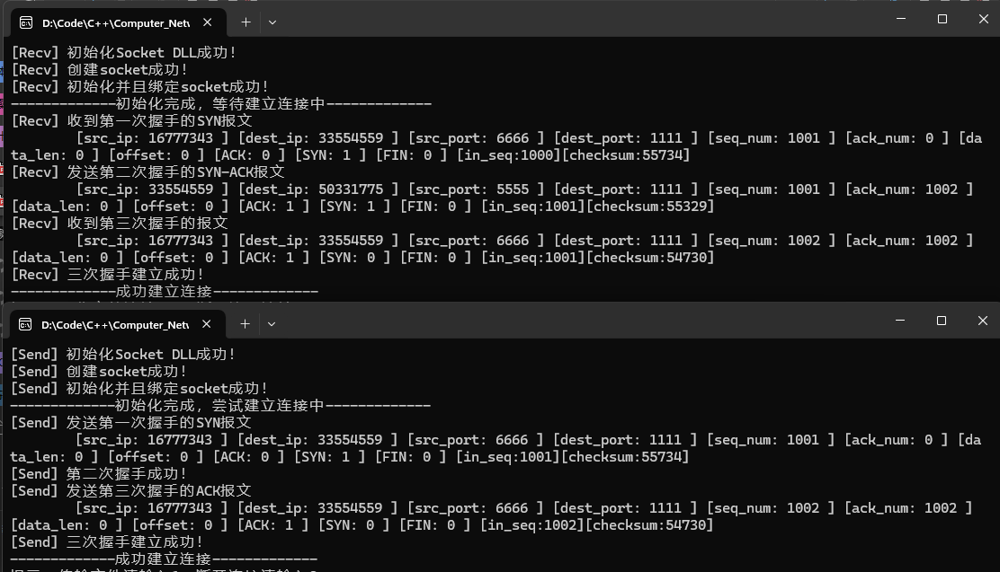
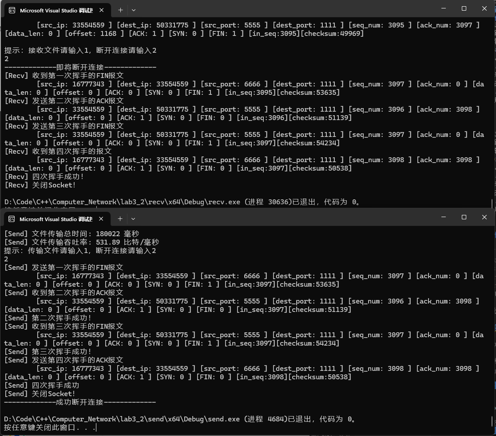


## （二）传输测试

1. 设置路由转发：丢包率3%，时延3ms
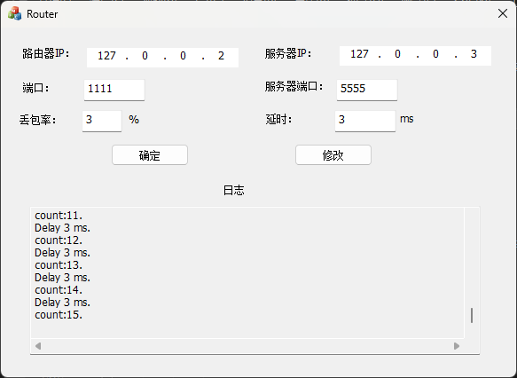

2. 传输测试文件helloworld.txt
   - 使用路由转发
     - 传输完成，可以看到，累计用时 23870 毫秒，吞吐率为 554.942 比特/毫秒。
     - 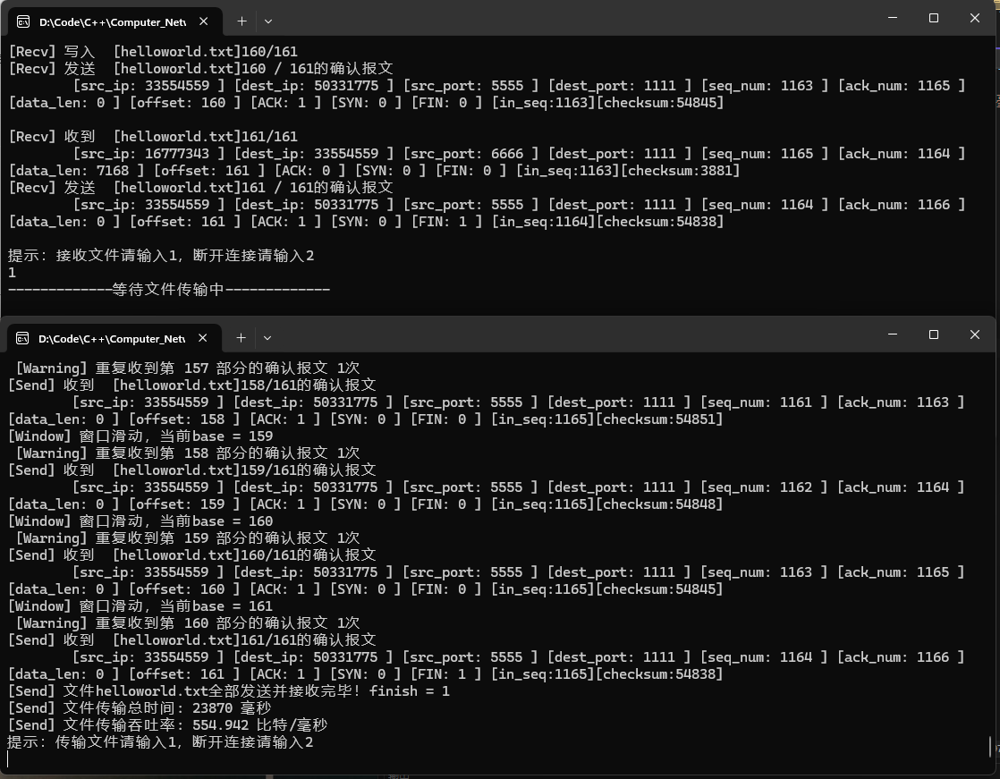
     - 查看文件属性，传输前后文件大小没有发生改变，传输无误
     - 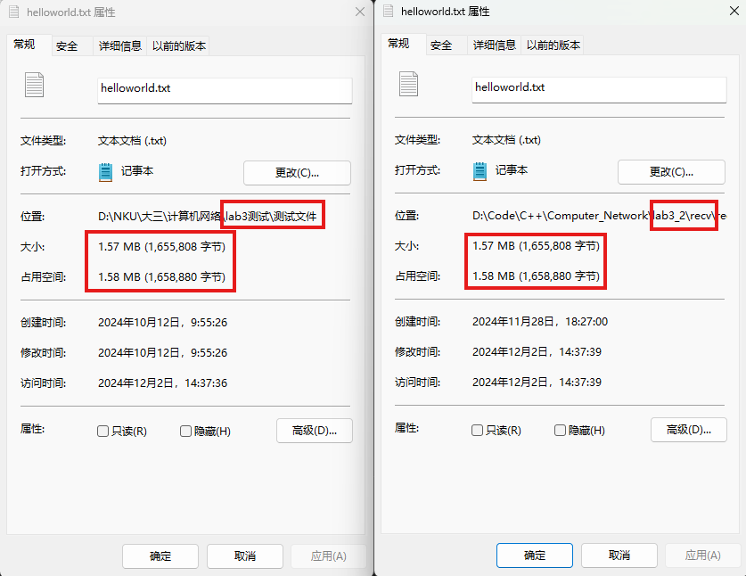

   - 不使用路由转发
     - 传输完成，可以看到，累计用时 2070 毫秒，吞吐率为 6399.26 比特/毫秒。
     - 
     - 查看文件属性，传输前后文件大小没有发生改变，传输无误

3. 传输测试文件1.jpg
   - 使用路由转发
     - 传输完成，可以看到，累计用时 29127 毫秒，吞吐率为 510.139 比特/毫秒。
     - 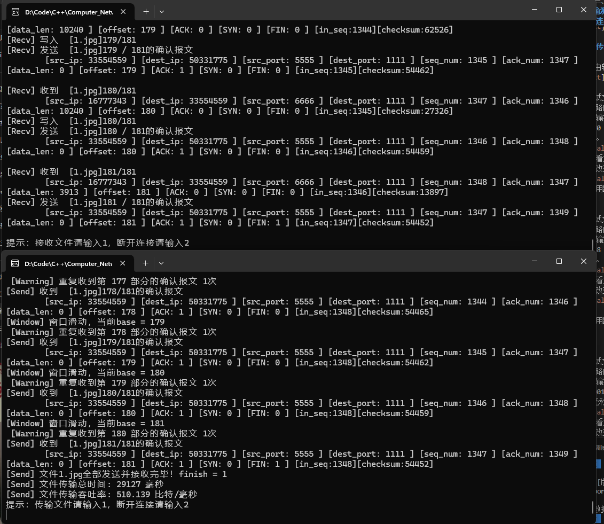
     - 查看文件属性，传输前后文件大小没有发生改变，传输无误
     - 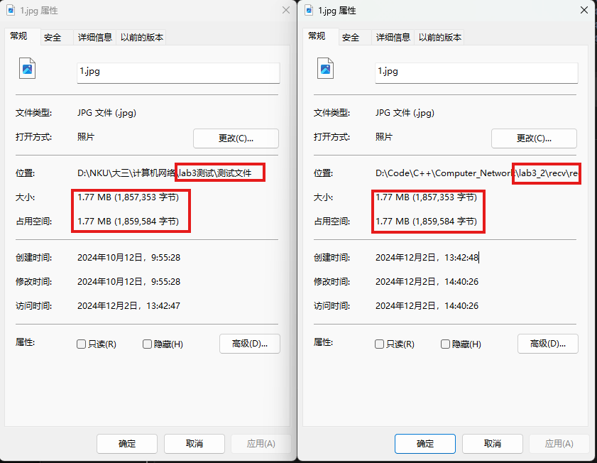

   - 不使用路由转发
     - 传输完成，可以看到，累计用时 1862 毫秒，吞吐率为 7980.03 比特/毫秒。
     - 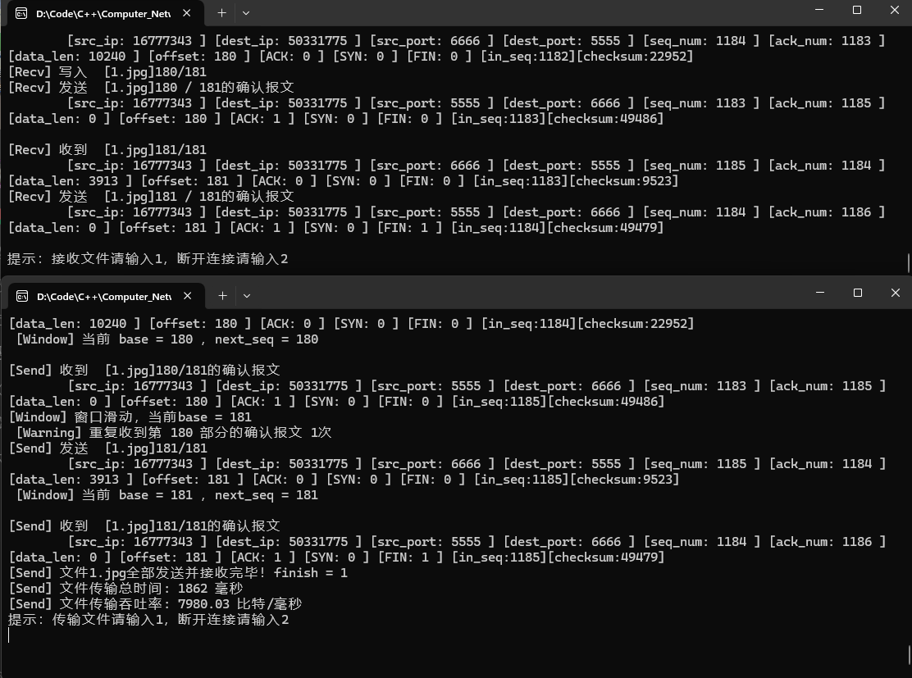
     - 查看文件属性，传输前后文件大小没有发生改变，传输无误

4. 传输测试文件2.jpg
   - 使用路由转发
     - 传输完成，可以看到，累计用时 84768 毫秒，吞吐率为 556.673 比特/毫秒。
     - 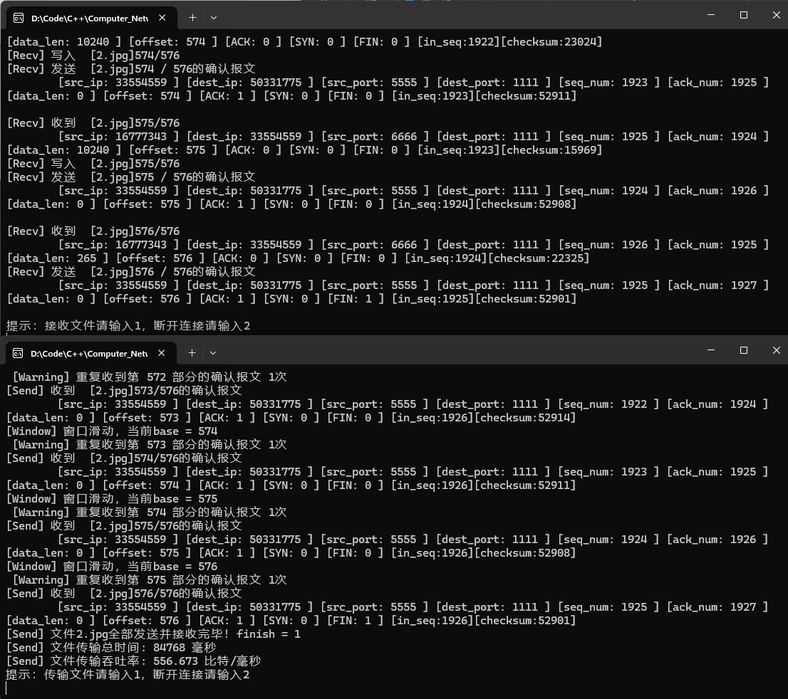
     - 查看文件属性，传输前后文件大小没有发生改变，传输无误
     - 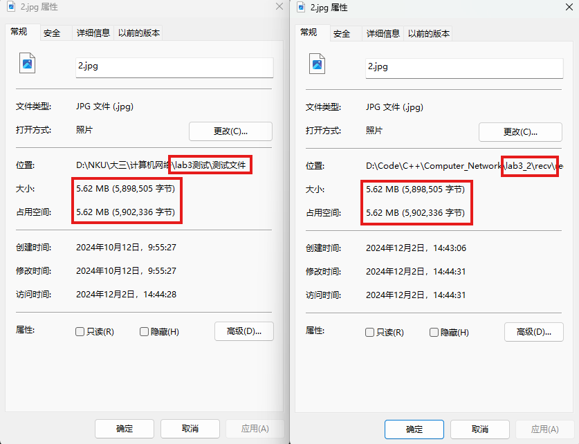
   - 不使用路由转发
     - 传输完成，可以看到，累计用时 8354 毫秒，吞吐率为 5648.56 比特/毫秒。
     - 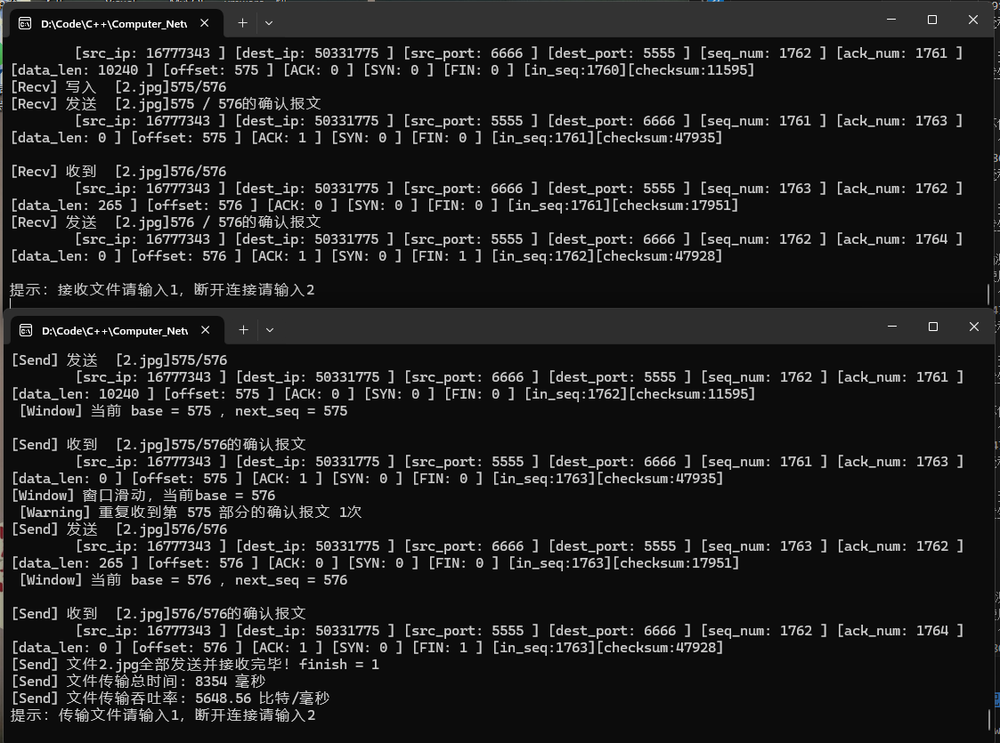
     - 查看文件属性，传输前后文件大小没有发生改变，传输无误

5. 传输测试文件3.jpg
   - 使用路由转发
     - 传输完成，可以看到，累计用时 180022 毫秒，吞吐率为 531.89 比特/毫秒。
     - 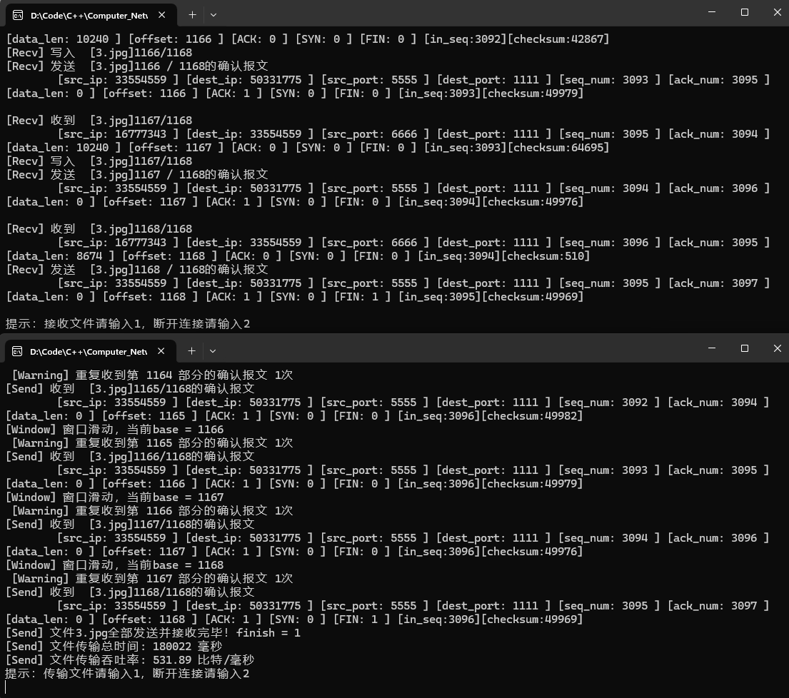
     - 查看文件属性，传输前后文件大小没有发生改变，传输无误
     - 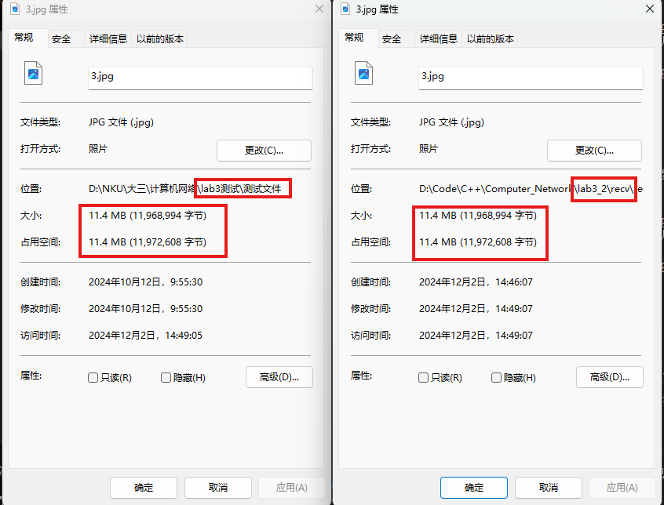
   - 不使用路由转发
     - 传输完成，可以看到，累计用时 18197 毫秒，吞吐率为 5261.96 比特/毫秒。
     - 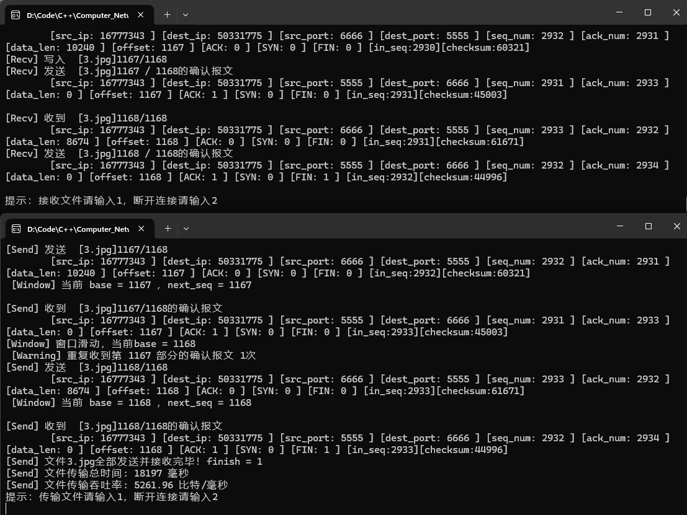
     - 查看文件属性，传输前后文件大小没有发生改变，传输无误

## （三）性能分析

在上面几项的传输测试中，针对累计传输用时、吞吐率均有输出，根据数据，绘制使用路由转发时，吞吐率、平均往返时延的数据分析图如下所示</br>
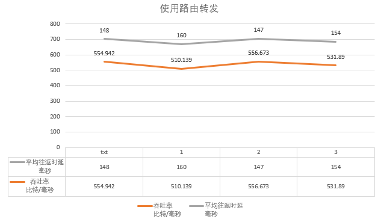

可以看到吞吐率与平均往返时延的值较为稳定

> 样本数量较少，这里仅供直观参考

# 四、实验中遇到的问题

1. 缓冲区大小设置问题：在传输txt文件时，会遇到如下图所示的报错。通过显示打印file_send.data的长度大小与MAX_DATA_LENGTH的值进行比较，发现file_send.data 的实际长度超出MAX_DATA_LENGTH。
但是传输jpg文件却不会遇到这种情况。
推测是txt中的换行符转换，引起的长度变化，于是在代码中将MAX_DATA_LENGTH的长度进行增加，解决该问题。
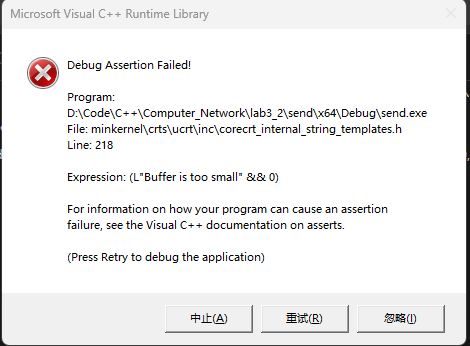

2. 根据带宽情况，实时调整等待时间
   - 在本次实验中，对于最大等待时间，使用了宏定义的TIMEOUT_MS，事实上，这样会导致传输效率低下
   - 在后续的实验中，计划参考教材中的设计思想，将上一个消息的往返时延作为当前消息的重传等待时间，实现按照网络带宽实时确定重传等待时间，提高传输效率。

```cpp{.line-numbers}
#define TIMEOUT_MS 2000          // 超时时间（毫秒）
```
