# 
计算机网络实验报告

## 
LAB3-4 基于 UDP 服务设计可靠传输协议并编程实现

## 
网络空间安全学院 物联网工程

## 
2211489 冯佳明

# 一、实验要求

基于给定的实验测试环境，通过改变网路的延迟时间和丢包率，完成下面3组性能对比实验：

（1）停等机制与滑动窗口机制性能对比；

（2）滑动窗口机制中不同窗口大小对性能的影响；

（3）有拥塞控制和无拥塞控制的性能比较。

# 二、实验环境

- 实验测试环境：
  - 发送方：Windows 11 家庭中文版
  - 接收方：Windows 11 家庭中文版
  - 网络：本地局域网

- 本次时延基于前三次实验完成，对日志的输出进行了一定的修改：仅对每次传输的吞吐率和时延进行输出，不输出每次传输的内容，避免I/O操作对传输性能的影响

> 为避免实验报告冗长，前三次实验的协议设计与代码实现详见附件中：
>
> - 2211489-冯佳明-编程作业3-1.pdf
> - 2211489-冯佳明-编程作业3-2.pdf
> - 2211489-冯佳明-编程作业3-3.pdf

# 三、实验内容

本次实验采用**控制变量法**完成性能对比测试与分析。

- **停等机制与滑动窗口机制性能对比：** 丢包率及时延相同的情况下，测试两种传输机制的吞吐率及时延；
- **滑动窗口机制中不同窗口大小对性能的影响：** 丢包率及时延相同的情况下，通过改变窗口大小，测试滑动窗口机制的吞吐率及时延；
- **有拥塞控制和无拥塞控制的性能比较：** 窗口大小相同的情况下，分别改变吞吐率或时延，测试并比较两种传输机制下传输文件的吞吐率及时延。

> 本实验报告中的数据均为多次测试的**平均值**，能够避免一些偶然因素导致的数据误差。

# 四、实验结果及分析

> 实验中丢包率的单位为%，吞吐率的单位为Byte/ms，时延的单位为ms。

## （一）停等机制与滑动窗口机制性能对比

设置丢包率为0，改变时延，比较停等机制与滑动窗口机制的吞吐率及时延。

- 实验数据： 
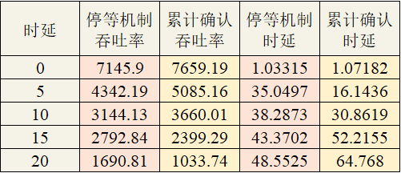
- 图形化结果： 
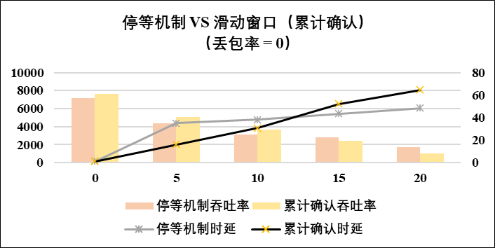

- 分析： 
  - 观察实验结果，当丢包率为0时，随着时延的增加，停等机制和滑动窗口机制的性能均有所下降。
  - 时延较低时，滑动窗口机制可以充分利用网络带宽，而停等机制则需要等待前一个数据包的确认，因此在时延较低时，滑动窗口机制的性能更好。
  - 时延较高时，由于滑动窗口机制需要重传整个缓冲区的数据，会导致性能下降，停等机制的性能较好。

设置时延为0，改变丢包率，比较停等机制与滑动窗口机制的吞吐率及时延。

- 实验数据： 
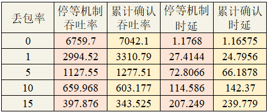

- 图形化结果： 
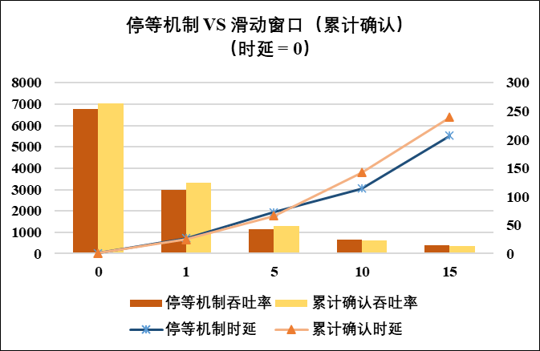

- 分析： 
  - 观察实验结果，当时延为0时，随着丢包率的增加，停等机制和滑动窗口机制的性能均有所下降。
  - 丢包率较小时，滑动窗口机制可以充分利用网络带宽，有者较好的性能。
  - 丢包率较大时，会频繁的导致数据包的重传，而滑动窗口机制需要重传整个缓冲区的数据，会导致性能下降，停等机制的性能较好。

## （二）滑动窗口机制中不同窗口大小对性能的影响

设置丢包率为0，改变时延，比较滑动窗口机制中不同窗口大小对性能的影响。

- 实验数据： 
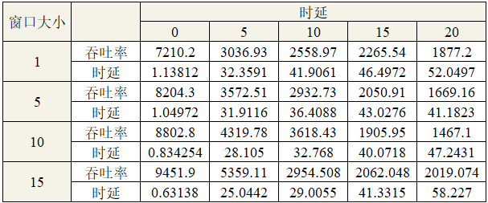

- 图形化结果： 
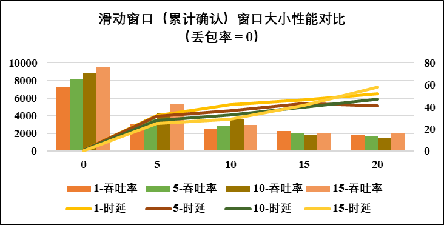

- 分析： 
  - 当丢包率为0时，随着时延的增加，无论窗口大小，性能均有所下降。
  - 随着窗口的增大，性能有所提高，但时延过高时，大的窗口反而会导致性能下降，推测依旧是由于需要重传整个缓冲区导致的。

设置时延为0，改变丢包率，比较滑动窗口机制中不同窗口大小对性能的影响。

- 实验数据： 
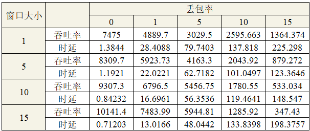

- 图形化结果： 
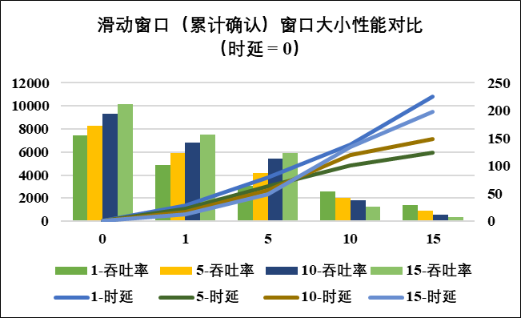

- 分析： 
  - 当时延为0时，随着丢包率的增加，无论窗口大小，性能均有所下降。
  - 随着窗口的增大，性能有所提高，但丢包率过高时，会导致窗口大小与性能增长成反比，因为丢包率较大时，会频繁的导致数据包的重传，而滑动窗口机制需要重传整个缓冲区的数据，窗口越大，需要重传的数据包越多，会导致性能下降。

## （三）有拥塞控制和无拥塞控制的性能比较

设置丢包率为0，改变时延，比较有拥塞控制和无拥塞控制的性能。

- 实验数据： 
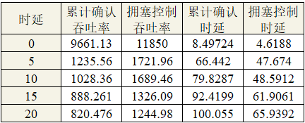

- 图形化结果： 
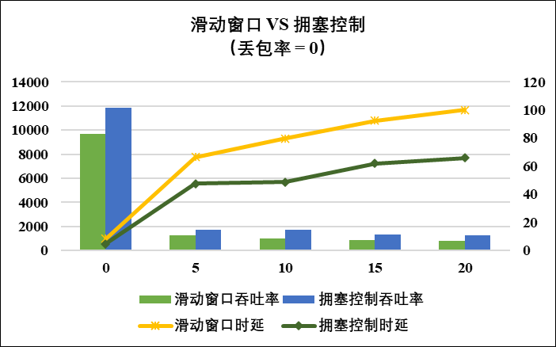

- 分析： 
  - 当丢包率为0时，随着时延的增加，两种机制的性能均有所下降。
  - 有拥塞控制的效果均优于无拥塞控制。

设置时延为0，改变丢包率，比较有拥塞控制和无拥塞控制的性能。

- 实验数据： 
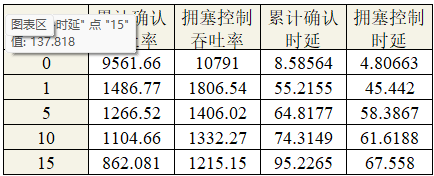

- 图形化结果： 
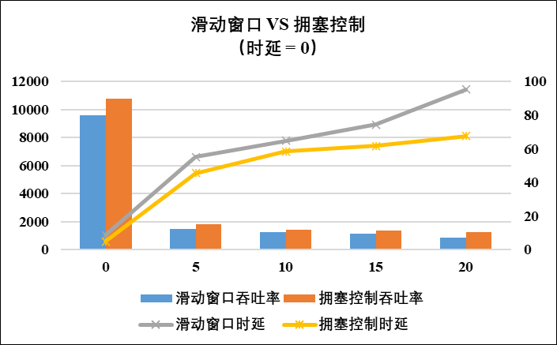

- 分析： 
  - 当时延为0时，随着丢包率的增加，两种机制的性能均有所下降。
  - 有拥塞控制的效果均优于无拥塞控制。

# 五、实验总结

综合以上实验数据以及这段时间的学习感悟，得出以下结论：

- 总体而言，性能：停等机制 ＜ 滑动窗口机制（累计确认） ＜ 拥塞控制的滑动窗口机制
- 时延和丢包率较低时，滑动窗口机制（累计确认）的性能优于停等机制
- 时延和丢包率较高时或者窗口大小较大时，由于需要重传整个缓冲区的数据，滑动窗口机制（累计确认）的性能反而不如停等机制
- 没有绝对的优秀的传输机制，只有合适的传输机制，在实际应用中，需要根据具体的需求选择合适的传输机制
- 本次实验的数据样本较少，仅供直观参考

> 写在最后的一些碎碎念，转眼就到了学期末，这一学期的计算机网络课程，无论是理论还是实验，都让我受益匪浅。感谢老师和助教学长学姐们的悉心教导，笔芯❤
